# Trans-diagnostic psychopathology across bipolar disorder, schizophrenia and depression is dimensional, not categorical: seven reproducible symptom dimensions that complement DSM diagnosis for patient-reported outcomes

**Authors.** [TO CONFIRM — author list, affiliations, corresponding author]

**Affiliations.** [TO CONFIRM — FondaMental Advanced Centres of Expertise (FACE) network sites]

**Running title.** Dimensional trans-diagnostic phenotypes in FACE

> Draft v0.2 — **methods-forward, preprint-first** (medRxiv → a methods-leaning journal,
> e.g. *Biological Psychiatry: CNNI* or *Translational Psychiatry*). Emphasis on the
> confound hierarchy, reproducibility, and dual-estimator validation. Figures are static
> artifacts in `results/reports/figures/`; all numbers are generated by the scripts named in each
> section. References were verified via PubMed (DOIs in the reference list).

---

## Abstract

**Background.** Bipolar disorder (BP), schizophrenia (SZ) and major depression (DR) share
symptoms, biology and treatment response, motivating a search for structure that cuts
across DSM categories. Whether trans-diagnostic structure is best described as a set of
discrete patient subgroups or as continuous dimensions remains unresolved, and
data-driven phenotyping of psychiatric records is vulnerable to confounding.

**Methods.** We harmonized longitudinal data (baseline V0 to 4-year follow-up V4) from
9,013 patients (BP 6,252; SZ 2,209; DR 552) across the multi-centre FACE cohort into a
unified clinical–biological feature matrix. Every estimator — the masked similarity, the
spectral embedding, the autoencoder objective, and the factor model itself — uses masked,
pairwise-complete operators, so no missing *feature* value is ever imputed (the factor model is
estimated from the pairwise-complete correlation matrix with posterior-mean scores on each
patient's observed support; an ablation showing why mean-filling biases the weakest factor is
in §3.8). After removing a hierarchy of confounds (administrative fields,
raw scale, and age/sex carried by physical-comorbidity flags) and aggregating items to
construct-level domain scores, we (i) formally tested for discrete versus dimensional
structure (Laplacian eigengap, gap statistic versus a Gaussian null, HDBSCAN density
clustering, bimodality, and DSM-subtype ordering); (ii) fit a confound-controlled
dimensional model (varimax factor analysis with split-half reproducibility selection,
cross-validated against a no-imputation masked autoencoder); and (iii) tested, in nested
cross-validation, whether the dimensions predict 1-year patient-reported and service-use
outcomes better than DSM diagnosis. Robustness was assessed by ComBat site harmonization,
consistency at a second follow-up (V2, same cohort), de-circularization, re-fitting the
factor model within each cross-validation fold, and within-FACE held-out replication
(leave-one-cohort and leave-one-site).

**Results.** Trans-diagnostic variation was **dimensional, not categorical**: the
similarity spectrum had no eigengap, the gap statistic rose monotonically with *k* (no
natural cluster count), top dimensions showed no clear multimodality, and the only dense discrete
structure recovered by HDBSCAN was diagnosis itself (cluster–cohort ARI 0.70). The seven
enrolled DSM subtypes ordered along a single mood↔psychosis continuum (|Spearman| 0.79).
A **seven-dimension model** was reproducible (masked split-half Tucker congruence 0.91 at $K=7$,
the maximum reproducible dimensionality), confound-free (|correlation| with age/sex ≤0.018; site
η² ≤0.053, cohort ≤0.113): depression/internalizing severity, later age-of-onset,
illness/hospitalization burden, mania/activation, an **externalizing/neurodevelopmental** axis
(impulsivity, childhood-ADHD, early adversity), metabolic/inflammatory load, and a
socio-occupational/work-disability axis. A no-imputation autoencoder recovered the same structure
(leading canonical correlation 0.97 vs a row-permutation null of 0.05). The dimensions
**outperformed DSM diagnosis** for quality of life (EQ-5D R² 0.34 vs 0.30; Δ +0.038, 95% CI
[+0.035, +0.042]) and **complemented** it for global functioning (combined R² 0.40 vs DSM 0.37;
Δ +0.034 [+0.032, +0.036]), while diagnosis plus prior service use dominated hospitalization
prediction (AUC 0.75). Both findings were
consistent at a second follow-up (V2, same cohort) and survived site harmonization and
de-circularization. Dimensions showed a trait–state gradient over follow-up (metabolic load
and depression most trait-like, test–retest *r* 0.63 and 0.55; activation, externalizing and
work-disability more state-like). A complementary BP/SZ cognitive analysis
(cognition is missing by design in DR) recovered the classic general-ability (*g*) plus
processing-speed structure, which was semi-independent of the symptom dimensions
(max |*r*| 0.26) and added a small independent increment to functioning.

**Conclusions.** Across BP, SZ and DR the categorical boundary that data support is the
diagnosis itself; everything trans-diagnostic is continuous. Seven reproducible,
confound-controlled symptom dimensions carry outcome-relevant information that diagnosis
lacks for patient-reported endpoints, supporting a dimensional augmentation of categorical
psychiatric nosology.

**Keywords.** trans-diagnostic; dimensional psychopathology; bipolar disorder;
schizophrenia; depression; factor analysis; confounding; patient-reported outcomes.

---

## 1. Introduction

### 1.1 The categorical model and its discontents

The categorical model of psychiatric nosology codified in DSM-5 and ICD-11 draws sharp
boundaries between bipolar disorder, schizophrenia and major depressive disorder — a
taxonomy whose intellectual lineage runs back to Kraepelin's nineteenth-century separation
of *dementia praecox* from manic-depressive illness. Operationalized diagnostic criteria
delivered a real advance in **reliability** (clinicians can be trained to agree on a label),
but the categories were never validated against an external ground truth: there is no
laboratory assay, pathognomonic lesion, or discrete genetic signature that cleanly separates
them, and a former NIMH director's much-quoted verdict was that the manual's "weakness is its
lack of validity." Three lines of evidence strain the categorical assumption. First, the
disorders **share genetic risk** on a large scale — cross-disorder analyses by the Psychiatric
Genomics Consortium find substantial pairwise genetic correlations and pleiotropic loci
spanning schizophrenia, bipolar disorder and depression [4,5]. Second, they **share
neurobiology, symptom expression and treatment response**: antipsychotics, mood stabilizers
and antidepressants are used across diagnostic lines, as are the cognitive, sleep and
inflammatory signatures that accompany them. Third, a large fraction of real patients sit
**ambiguously between categories** — schizoaffective disorder, mixed affective states,
psychotic depression and bipolar-NOS are not rare curiosities but the clinical rule, and
their position is precisely what a categorical system handles worst. The practical cost is
not merely taxonomic: a system that cannot represent "between" patients cannot guide their
treatment, and a label that is reliable but not valid anchors research cohorts to a construct
that may not carve nature at its joints.

### 1.2 Two reform programmes: dimensions and biotypes

These tensions have driven two influential, and partly opposing, research programmes. The
first is the **dimensional reframing** of psychopathology. NIMH's Research Domain Criteria
(RDoC [1]) proposed to replace disorders with trans-diagnostic functional domains (negative
and positive valence, cognitive systems, arousal/regulatory systems) measured across units of
analysis from genes to behaviour. The Hierarchical Taxonomy of Psychopathology (HiTOP [2])
assembled the empirical covariance of symptoms into a hierarchy of **continuous spectra** —
internalizing, thought disorder, detachment, externalizing, antagonism — culminating, at its
apex, in a single general factor of psychopathology, the "*p* factor" [3], conceptually
analogous to *g* in intelligence research. Taxometric studies of individual syndromes have
repeatedly favoured **continuous over categorical latent structure** [18]. Orthogonal to this
structural axis, clinical-staging models [17] reframe disorders by **temporal progression**
(at-risk → first episode → recurrence → chronicity), making explicit that any cross-sectional
snapshot conflates enduring *trait* with illness *state* and *stage* — a confound we revisit
directly in our longitudinal analysis.

The second programme is data-driven **biotyping** [6]: the search for discrete patient
subgroups — "biotypes" — from clinical and biological data, with the promise that such strata
would predict treatment response where DSM categories do not. Its appeal for precision
medicine is obvious, because discrete strata map naturally onto discrete treatment decisions.
High-profile solutions followed — three psychosis biotypes from neurophysiology (Clementz et
al. [6]); four depression biotypes from resting-state fMRI connectivity (Drysdale et al. [16])
— but the programme has since weathered a **replication crisis**. Independent re-analysis with
proper null comparisons and resampling showed that the four-biotype depression solution was
**not statistically distinguishable from a continuum** [7], and that the apparent cluster
structure was largely an artifact of imposing a fixed cluster count on smoothly distributed
data. Whether genuinely discrete subgroups exist — and if so, whether they are *clinical* or
only *biological* — is the central unresolved question our study targets head-on.

### 1.3 Two open questions

Two questions therefore remain incompletely answered. First, **is trans-diagnostic structure
discrete or dimensional?** Most biotyping pipelines *assume* discreteness — they apply a
clustering algorithm, which by construction always returns clusters — and rarely test the
logically prior question of whether discrete structure exists at all, as opposed to slicing a
continuum at arbitrary cut-points. The distinction is not academic: a continuum modelled as
categories yields unstable, unreplicable, treatment-uninformative strata, which is exactly the
pattern the biotype literature has produced. Second, **does any data-driven representation add
clinical value over the diagnosis a clinician already records?** A latent representation that
merely re-encodes diagnosis, age, sex or recruiting site is statistically interesting but
clinically inert; the bar for a *useful* phenotype is incremental prediction of outcomes that
matter to patients and services, over and above the label already in the chart.

### 1.4 The data-science hazard: confounding and informative missingness

Data-driven phenotyping of real-world psychiatric records is, moreover, treacherous in ways
well understood in machine learning but under-appreciated in clinical applications.
Unsupervised methods recover the **largest-variance axis** in the feature matrix, which in
routine clinical data is almost always a **nuisance** — a record-keeping artifact, a
measurement-scale difference, or a demographic gradient — rather than psychopathology. This is
the clinical analogue of **shortcut learning** [20]: the model latches onto whatever signal is
cheapest to extract, and "novel subtypes" routinely turn out to track site, age, sex or
diagnosis once those are interrogated. The hazard is compounded by **missingness that is itself
informative** (missing-not-at-random): different cohorts and sites receive different instrument
batteries, so the *pattern* of what was measured silently encodes the diagnosis. Naïvely
imputing such gaps injects the very confound one is trying to avoid — in our data, cohort is
**98% predictable from the observation mask alone**. A credible phenotyping pipeline must
therefore (i) avoid imputation wherever the geometry allows, (ii) explicitly strip the
confound hierarchy before modelling, and (iii) validate against *external* outcomes rather than
internal cluster-quality indices that reward any partition of any data.

### 1.5 The present study

We address both questions in the FACE multi-centre cohort of bipolar, schizophrenia and
depression patients [9,10], deeply phenotyped at baseline and followed annually to four years.
Its scale (9,013 patients), breadth (psychiatric scales, functioning, sleep, substance use,
trauma, personality/impulsivity, antecedents and routine biology) and longitudinal design make
FACE unusually well-suited to separate trait from state and structure from confound. Our
contributions are: (1) a transparent account of the **confounding hierarchy** that defeats
naïve clustering of psychiatric records, and the controls that remove it; (2) a formal
**discrete-versus-dimensional test** showing that the only categorical structure the data
support is diagnosis itself, while trans-diagnostic variation is continuous; (3) a
**reproducible, confound-controlled, site-robust seven-dimension model** of trans-diagnostic
psychopathology, cross-validated by two methodologically independent estimators — a linear
factor model and a nonlinear, no-imputation autoencoder; and (4) a leakage-safe **head-to-head
test** showing these dimensions complement or outperform DSM diagnosis for patient-reported
outcomes. We deliberately report the dimensional model rather than discrete biotypes because
that is what the data support — and we argue that the **validation discipline** itself
(reproducibility, confound-orthogonality, site-robustness, and prospective outcome prediction,
rather than internal separation) is a transferable standard for data-driven psychiatric
phenotyping.

---

## 2. Methods

### 2.1 Cohort and data harmonization

We analysed 9,013 patients enrolled at FACE expert-centre sites [9,10]: BP 6,252, SZ 2,209
and DR 552 (Table 1). Patients carried one of seven enrolled DSM subtypes — bipolar I, II and
NOS; schizophrenia, schizoaffective and schizophreniform disorder; and major depressive
disorder — recorded at enrolment. Assessments spanned baseline (V0) and annual follow-ups
to V4. A common-variables dictionary mapped per-cohort source columns to harmonized
canonical variables across 13 clinical/biological blocks (psychiatric symptom scales,
functioning, sleep, substance use, trauma, personality/impulsivity, antecedents, medical
evaluation, and laboratory biology). Patients were keyed by a globally unique identifier
(`cohort::usubjid`) because subject identifiers collide across cohorts (970 collisions).

The harmonization is itself a non-trivial inferential step, not mere relabelling. The three
cohorts were assembled by separate expert networks with overlapping but distinct instrument
batteries, coding conventions and visit schedules; a *common-variables dictionary* (one row
per harmonized variable, carrying its per-cohort source columns, value set, dtype, clinical
section and a transformation rule) maps them onto a single canonical schema, and each variable
is graded for cross-cohort *readiness* (READY / PARTIAL / not reconcilable). We retained the
READY and PARTIAL variables (351 harmonized variables). The resulting matrix is **block-sparse
by construction**: a variable collected only in the bipolar protocol is systematically missing
for schizophrenia and depression patients, so the missingness pattern is not random noise but a
near-deterministic fingerprint of cohort membership. This is the structural reason imputation
is hazardous here (§1.4) and the motivation for the masked, pairwise-complete operators below —
we want each model to see *what was measured*, never a fabricated value standing in for what a
different protocol would have measured.

We avoided imputation throughout: the masked similarity, the spectral embedding, the
autoencoder objective **and the factor model itself** all use masked, pairwise-complete
operators, so missing feature values never enter any estimator as filled-in numbers —
important because missingness in psychiatric records is informative and differential by
cohort. The factor model is estimated from the pairwise-complete correlation matrix with
posterior-mean scores on each patient's observed support (§2.7); the residual domain matrix
is **65% observed**, but those gaps are never filled. An earlier mean-filled factor analysis
was superseded once an ablation showed the fill reweights correlations by co-observation and
biases the weakest factor (§3.8).

### 2.2 Notation and the no-imputation convention

Let $N$ patients be indexed by $i$ and harmonized items by $f$. Write $x_{if}\in\mathbb{R}$
for an observed value and define the **observation mask** $m_{if}=\mathbb{1}[x_{if}\text{ observed}]$.
We apply **no imputation**: every similarity, covariance and reconstruction is computed on
the observed support only (pairwise-complete / masked), so a missing entry never enters as a
filled-in number. This matters because missingness in psychiatric records is informative and
differential by cohort (e.g. neuropsychology is absent in DR by design). The only place a feature
value is substituted is mean-imputation of *covariates* in the residualization design matrix
(§2.4); it never touches the domain values themselves. The autoencoder is fed zeros for missing
entries but flags them through the input mask and excludes them from the reconstruction loss
(§2.8), and the factor model uses the pairwise-complete correlation matrix with posterior-mean
scores on each patient's observed support (§2.7) — so no imputed feature value contributes to
any estimator's objective.

### 2.3 Robust scaling and construct-level domain aggregation

Cosine and covariance treat each column as one equal dimension, so an instrument with many
items contributes many dimensions and silently dominates (in the raw clinical set the 15-item
suicidality scale alone accounted for 30% of dimensions). We therefore aggregate items to
**construct-level domain scores**. Each item is first robustly scaled (`domains.py`):
winsorize to its 1st/99th percentiles, then

$$z_{if}=\frac{x_{if}-\mathrm{med}_f}{1.4826\cdot \mathrm{MAD}_f},\qquad
\mathrm{MAD}_f=\operatorname{median}_i\big|x_{if}-\mathrm{med}_f\big|,$$

with the fallback $1.4826\cdot\mathrm{MAD}_f\!\to\!\hat\sigma_f$ when $\mathrm{MAD}_f=0$. The
constant $1.4826$ makes the scale consistent for Gaussian data. Symptom items are grouped into
one domain per **instrument stem** (canonical name with the trailing item index stripped, regex
`\d+[a-z]*$`: `madrs07`→`madrs`); biology items are grouped into curated composites
$d$ with member set $M_d$ and clinical signs $s_f\in\{\pm1\}$ ("higher = more pathological":
metabolic syndrome [BMI, waist, triglycerides, HDL$^-$, glucose, HbA1c, blood pressure],
cholesterol, inflammation, hepatic, renal, prolactin, cardiac/QTc). For observed members
$O_{id}=\{f\in M_d:m_{if}=1\}$ the masked, sign-oriented domain score is

$$g_{id}=\frac{1}{|O_{id}|}\sum_{f\in O_{id}} s_f\,z_{if}
\quad\text{if } \frac{|O_{id}|}{|M_d|}\ge \tau,\ \text{else } \texttt{NaN},$$

with minimum-observed fraction $\tau=0.5$ (no imputation: under-observed domains stay missing).
We retain domains observed in $\ge\!30\%$ of patients (54 of 72).

Two choices here deserve emphasis because they are exactly where naïve pipelines fail. First,
**aggregation to constructs is a psychometric necessity, not a convenience**: cosine and
covariance weight each column equally, so an instrument split into many items contributes many
near-collinear dimensions and dominates the geometry by item count alone (in the raw clinical
set a single 15-item suicidality scale supplied ~30% of the dimensions). Collapsing items to
one score per construct restores a one-construct-one-dimension geometry and is the
representational counterpart of the confound control in §2.4 — both prevent a high-variance but
clinically narrow signal from masquerading as global structure. Second, **robust scaling
(median/MAD with winsorization) rather than mean/SD** is used because clinical and especially
laboratory variables are heavy-tailed and contaminated with data-entry outliers; under ordinary
*z*-scoring a single mis-keyed laboratory value can distort an entire feature's contribution to
every patient's similarity, whereas the median and MAD have a ~50% breakdown point. The masked,
sign-oriented domain score (above) further guarantees a construct is computed only when at least
half its members are observed and is signed so that "higher = more pathological," so composites
are directly comparable in direction across the biology blocks.

### 2.4 Confounder residualization (nonlinear, cross-fitted)

Unsupervised structure recovers the largest-variance nuisance axis unless it is removed
(Section 3.1). We partial age $a_i$ and sex out of every domain by **double/debiased-ML-style
residualization** (`adapter.py`). Continuous covariates are expanded in a cubic B-spline
basis $B(\cdot)$ (degree 3, 4 knots; scikit-learn `SplineTransformer`), and the design adds
covariate×discrete interactions (e.g. sex-specific age curves):

$$A_i=\big[\,1,\ B(a_i),\ \mathrm{sex}_i,\ B(a_i)\!\otimes\!\mathrm{sex}_i\,\big],$$

with covariate `NaN`s mean-imputed *for the design matrix only*. For each domain $d$ we solve
the masked least-squares fit $\hat\beta_d=\arg\min_\beta\sum_{i:\,m_{id}=1}(g_{id}-A_i\beta)^2$
and take residuals $r_{id}=g_{id}-A_i\hat\beta_d$. To avoid over-correction we use **$K$-fold
cross-fitting** ($K=5$): $\hat\beta_d$ is estimated out-of-fold, so $r_{id}=g_{id}-A_i\hat\beta_d^{(-\kappa(i))}$
where $\kappa(i)$ is $i$'s fold (Chernozhukov et al.). Feature `NaN`s are preserved. This drives
the maximum $|{\rm corr}|$ of any downstream dimension with age/sex to $\le 0.002$ (Section 3.3).

Three features of this residualization are deliberate. (i) **Cross-fitting** (out-of-fold
estimation of $\hat\beta_d$) implements the Neyman-orthogonal, double/debiased-ML principle
[19]: estimating the nuisance adjustment on the same rows to which it is applied over-fits the
confounder and *over-corrects*, draining genuine signal into the residual; out-of-fold
estimation makes the residual first-order insensitive to small errors in the nuisance fit. (ii)
**Nonlinear (spline) covariate expansion** matters because the confound is nonlinear — age
relates to laboratory biology, lifetime hospitalization counts and onset variables through
curved, often sex-specific trajectories that a single linear term would leave partly in the
residual to re-emerge as a spurious "axis." (iii) We residualize **only age and sex, not cohort
or site**, by design: cohort and site are precisely what we later want to test the dimensions
*against* (a dimension that survives is one not reducible to them), and aggressive
residualization is itself a trap — partialling out a variable on the causal path can induce
collider/over-control bias and *manufacture* orthogonality. We therefore strip only the
demographic nuisances that §3.1 shows actively hijack the geometry, and **measure** residual
cohort/site dependence afterwards (η², §3.3) rather than assuming it away.

### 2.5 Masked similarity and spectral embedding

For the structure test and the (superseded) consensus clustering we embed patients with the
vendored engine's **masked pairwise-complete cosine** similarity. For patients $i,j$ with
commonly-observed features $O_{ij}=\{f:m_{if}=m_{jf}=1\}$,

$$\operatorname{sim}(i,j)=\frac{\sum_{f\in O_{ij}} \tilde z_{if}\,\tilde z_{jf}}
{\sqrt{\sum_{f\in O_{ij}}\tilde z_{if}^2}\;\sqrt{\sum_{f\in O_{ij}}\tilde z_{jf}^2}},$$

on robustly-scaled residual domains $\tilde z$. The engine
(`MultipartiteSpectralEmbedding`) builds a $k$-nearest-neighbour graph ($k=10$) within each
cohort-coverage partition, computes a per-partition spectral embedding (8 components) from the
**symmetric normalized Laplacian** $L=I-D^{-1/2}WD^{-1/2}$ (with $D=\operatorname{diag}(W\mathbf 1)$),
weights each partition by $\sqrt{n_{\text{features}}\,n_{\text{patients}}}$, $L_2$-normalizes, and
concatenates. Missing values never enter $\operatorname{sim}$, so the embedding is imputation-free.

The rationale for a **graph-spectral** embedding rather than PCA on a filled matrix is twofold.
First, masked pairwise-complete cosine compares each patient pair on **exactly the features both
have**, so no imputed value ever enters a distance — PCA has no masked analogue without first
fabricating the missing cells. Second, partitioning by **cohort-coverage** before embedding (the
*multipartite* construction) stops the block-sparse missingness from dominating: patients are
compared most strongly with others measured on the same battery, and the per-partition spectral
coordinates are then weighted by information content and concatenated, so a densely-measured
block does not drown a sparsely-measured one. The symmetric normalized Laplacian
$L=I-D^{-1/2}WD^{-1/2}$ is the canonical operator whose low-lying eigenvectors give a
distortion-minimizing embedding of a similarity graph (its quadratic form penalizes assigning
distant coordinates to strongly-connected patients); its eigenvalue **spectrum** is, not
coincidentally, the very object the structure test (§2.6) interrogates for a discrete gap.

### 2.6 Discrete-versus-dimensional structure test

On the embedding $Z$ (`04_structure_test.py`) we ran five complementary tests:

1. **Eigengap.** On a $k=15$ kNN graph of $Z$ we form $L=I-D^{-1/2}WD^{-1/2}$ and inspect its
   ordered eigenvalues $\lambda_1\le\lambda_2\le\cdots$; a discrete $k$-cluster geometry shows a
   jump $\lambda_{k+1}-\lambda_k$, a continuum shows a smooth rise.
2. **Gap statistic vs a matched-Gaussian null.** For $k=2..12$ we fit $k$-means (inertia $W_k$)
   and compare $\log W_k$ and the silhouette to $n_{\text{ref}}=5$ draws from a Gaussian
   $\mathcal N(\hat\mu,\hat\Sigma)$ matched to $Z$; $\mathrm{gap}(k)=\mathbb{E}^\ast[\log W_k]-\log W_k$.
   A *monotone* gap (no peak) indicates no natural $k$.
3. **Density clustering.** HDBSCAN (`min_cluster_size`$=150$, `min_samples`$=10$) yields dense
   clusters, a noise fraction, and the adjusted Rand index ${\rm ARI}$ of its labels against cohort.
4. **Bimodality.** For the top principal axes we compute Sarle's coefficient
   $\mathrm{BC}=\dfrac{\gamma_1^2+1}{\gamma_2+\frac{3(n-1)^2}{(n-2)(n-3)}}$ (skew $\gamma_1$,
   excess kurtosis $\gamma_2$). A normal distribution gives $\mathrm{BC}\approx0.33$, a uniform
   $5/9\approx0.556$, and a clearly bimodal one $\to1$; values *clearly* above 0.556 suggest
   multimodality, whereas a value *at* 0.556 indicates an approximately flat (not bimodal) axis.
5. **DSM-subtype ordering.** We rank the seven subtypes on an a-priori mood→psychosis scale and
   correlate (Spearman $\rho$) the rank with each subtype's PC centroid.

The decision rule (transparently, **not pre-registered** — an initial automated heuristic
over-called discreteness and was revised once, then fixed, before the dimensional modelling):
*discrete trans-diagnostic* structure requires a peaking gap, dense clusters not explained by
diagnosis (${\rm ARI}(\text{HDBSCAN},\text{cohort})<0.30$), and multimodal axes;
${\rm ARI}(\text{HDBSCAN},\text{cohort})\ge0.40$ implies the only discrete structure is
diagnosis itself.

The deeper motivation for a *battery* of five tests is that "clusters versus continuum" is only
weakly identifiable from a finite sample: a clustering algorithm always returns clusters, and
any continuum can be diced into groups with non-trivial internal cohesion, so no single index
settles the question. We therefore triangulate properties that a *genuine* discrete geometry
must exhibit and a continuum cannot counterfeit. A true $k$-cluster graph has $k$ near-zero
Laplacian eigenvalues and then a **jump** (the eigengap); a continuum's spectrum rises
smoothly. A true $k$ shows **excess within-cluster compactness over a unimodal null at that $k$
and not beyond** (a peaking gap statistic); a continuum's gap rises monotonically because each
extra cut keeps helping. A discrete mixture shows **multimodal marginals**; a continuum is
flat/unimodal. And genuine subgroups are **density-separated** (HDBSCAN); a continuum has, at
most, density structure that coincides with a label already known (here, diagnosis) rather than
a novel one. Reading the four signatures together — rather than trusting any one — is what makes
the verdict robust, and is the discipline that the biotype literature, which typically reports
only an internal cluster-quality index, most often omits.

### 2.7 Dimensional factor model

We model the residual domain matrix as continuous latent dimensions, estimated **without any
imputation** (`07_dimensional_refine.py`; an earlier exploration on a mean-filled matrix,
`05_dimensional_axes.py`, was superseded after the §3.8 ablation showed the fill biases the
weakest factor). We use a **factor model** $X=F\Lambda^\top+\varepsilon$ rather than PCA because
the question is generative and latent — domains are noisy *indicators* of a few unobserved
dimensions, and factor analysis, unlike PCA, separates shared (common-factor) from unique
variance.

*Loadings (imputation-free).* The model is estimated from the **pairwise-complete (masked)
correlation matrix** $R$: each $R_{fg}$ uses only the patients observed on both domains $f,g$,
so no cell is ever filled ($R$ is projected to the nearest positive-definite correlation
matrix; here every domain pair has $\ge\!1{,}001$ co-observed patients, so $R$ is well-estimated
and already positive-definite). We extract $K$ factors by **principal-axis factoring** (iterated
communalities) and apply a **varimax** rotation $\Lambda\mapsto\Lambda R$ maximizing
$\sum_k[\frac1p\sum_f\lambda_{fk}^4-(\frac1p\sum_f\lambda_{fk}^2)^2]$ (simple structure), so each
domain loads on few factors and the axes are interpretable as named dimensions.

*Scores (imputation-free).* Per-patient factor scores are the FA **posterior mean computed on
each patient's observed support only**, so no imputed value enters a score either:
$$f_i=\big(I+\Lambda_{o}^{\!\top}\Psi_{o}^{-1}\Lambda_{o}\big)^{-1}\Lambda_{o}^{\!\top}\Psi_{o}^{-1}z_{i,o},
\qquad \Psi=\mathrm{diag}(1-\text{communality}),$$
where $o$ indexes patient $i$'s observed domains and $z_{i,o}$ their standardized residual
values (uniquenesses floored at 0.05 to guard Heywood cases). The longitudinal projection
(§2.10) applies the locked V0 loadings to each follow-up visit by the same masked scoring.

*Number of factors.* Horn's **parallel analysis** [11] over-extracted ($K\approx14$: with 54
domains many tiny construct-specific factors clear the permutation null without being
*reproducible*), so $K$ was fixed by **out-of-sample reproducibility** — split-half Tucker
congruence [12] on the masked covariance,
$\phi(a,b)=|\boldsymbol\lambda_a^{(1)\top}\boldsymbol\lambda_b^{(2)}|/(\lVert\boldsymbol\lambda_a^{(1)}\rVert\,\lVert\boldsymbol\lambda_b^{(2)}\rVert)$:
a real factor should reappear when the model is re-fit on an independent half of patients. This
reframes factor-count selection from "how much variance is explained" to "what replicates" — the
property that matters for a clinical phenotype and the one the biotype literature most
conspicuously lacked. The masked split-half minimum congruence is $\ge0.85$ through $K=7$ (a local maximum, 0.91) and
collapses at $K\ge8$ (the $K=8$ minimum falls to 0.22); we therefore lock **$K=7$** as the
**maximum reproducible dimensionality**. Relative to the prior $K=6$ solution the seventh axis
*splits* the conflated mania/activation+impulsivity factor into a *pure* mania axis and a distinct
externalizing/neurodevelopmental axis (childhood-ADHD, impulsivity, early adversity; §3.3) — the
genuine, imputation-free counterpart of the ADHD/trauma signal that mean-filling had rendered
artifactual at $K=6$ (§3.8); $K=4$ and $K=6$ remain defensible, more parsimonious alternatives.
Confounding was quantified as
$\max_k\max\{|{\rm corr}(F_{\cdot k},a)|,|{\rm corr}(F_{\cdot k},\mathrm{sex})|\}$.

### 2.8 Masked autoencoder for dimensionality compression (no-imputation cross-check)

As a nonlinear counterpart to the linear factor model, we compress the $d=54$ residual domain
scores into a $K$-dimensional latent code with an **undercomplete autoencoder** trained under a
masked reconstruction loss (`06_dimensional_ae.py`, PyTorch); we set $K=7$ to match the factor model
and ask whether the two recover the same subspace.

*Inputs.* Let $r_i\in\mathbb R^{d}$ be patient $i$'s per-domain-standardized residual vector and
$m_i\in\{0,1\}^{d}$ its **observation mask** ($m_{if}=1$ iff domain $f$ is observed). Define the
zero-filled vector $x^0_i = m_i\odot r_i$ (missing entries set to the standardized mean, $0$) and
the **mask-augmented** input $u_i=[\,x^0_i\,;\,m_i\,]\in\mathbb R^{2d}$, so the encoder can tell a
genuine zero from a missing-then-zeroed entry.

*Encoder / decoder.* With one hidden layer of width $h=64$, ReLU activation $\sigma$, and a
**linear bottleneck**, the compression map $f_\theta$ and reconstruction map $g_\psi$ are

$$
z_i \;=\; W_2\,\sigma\!\big(W_1 u_i + b_1\big) + b_2 \;\in\; \mathbb R^{K}
\qquad(\text{encoder } f_\theta:\ \mathbb R^{2d}\!\to\!\mathbb R^{K}),
$$

$$
\hat x_i \;=\; W_4\,\sigma\!\big(W_3 z_i + b_3\big) + b_4 \;\in\; \mathbb R^{d}
\qquad(\text{decoder } g_\psi:\ \mathbb R^{K}\!\to\!\mathbb R^{d}),
$$

with parameters $\Theta=\{W_1,b_1,\dots,W_4,b_4\}$, $W_1\in\mathbb R^{h\times 2d}$,
$W_2\in\mathbb R^{K\times h}$, $W_3\in\mathbb R^{h\times K}$, $W_4\in\mathbb R^{d\times h}$. The
bottleneck $z_i$ is the **compressed representation** (the learned dimensions); $K\ll d$ forces
the network to retain only the dominant axes of co-variation.

*Loss (masked / no imputation).* The reconstruction error is evaluated **only on observed
entries**, so imputed zeros never enter the objective or its gradient:

$$
\mathcal L(\Theta)\;=\;\frac{\displaystyle\sum_{i=1}^{N}\sum_{f=1}^{d} m_{if}\,\big(\hat x_{if}-r_{if}\big)^2}
{\displaystyle\sum_{i=1}^{N}\sum_{f=1}^{d} m_{if}}
\;=\;\frac{\sum_{i}\big\lVert m_i\odot(\hat x_i-r_i)\big\rVert_2^2}{\sum_{i}\lVert m_i\rVert_1}.
$$

The zero-fill in $x^0_i$ is thus an *input placeholder*, flagged to the encoder by $m_i$ and
masked out of $\mathcal L$ — no imputed value is ever fit, as with the masked factor model
(§2.7); the zero-fill is an input placeholder only.

*Optimization.* We minimize $\mathcal L$ by Adam (learning rate $10^{-3}$; weight decay
$\lambda=10^{-5}$, i.e. $\ell_2$ regularization $+\tfrac{\lambda}{2}\lVert\Theta\rVert_2^2$),
mini-batches of $512$, $300$ epochs, fixed seed. The trained bottleneck
$z_i=f_{\hat\theta}(u_i)$ gives each patient's $K$-dimensional code.

*Agreement with the factor model.* Stacking the AE codes $Z=[z_1,\dots,z_N]^\top$ and the
varimax factor scores $F$, we measure whether the two methods span the same subspace by
**canonical correlation analysis**: we seek unit-variance projections maximizing
$\rho_j=\max_{a_j,b_j}\operatorname{corr}(Za_j,\,Fb_j)$ subject to orthogonality to
$\{a_l,b_l\}_{l<j}$; the canonical correlations $\rho_1\ge\cdots\ge\rho_K$ are the agreement
spectrum. Because CCA maximizes correlation by construction and both representations are fit to
the same standardized matrix, $\rho_j$ is an upper-bound-style measure and is interpreted as a
*cross-check*, not independent confirmation (§4.2). The locked classical seven-dimension scores
(`results/dimensional_final_scores.parquet`) — not the AE codes — were carried into all
downstream analyses.

The autoencoder plays a specific epistemic role: it is a **methodologically independent
estimator** of the same latent subspace under a different inductive bias. Where the factor
model is linear, Gaussian and fit by maximum likelihood, the autoencoder is a nonlinear (ReLU)
function approximator fit by stochastic gradient descent under an explicitly **masked**
reconstruction loss, so imputed zeros never enter its objective — like the masked factor model
(§2.7), both estimators are now imputation-free, and they differ instead in functional form
(linear vs nonlinear) and fitting principle. The **mask-augmented input** $u_i=[x^0_i;m_i]$ lets
the encoder condition on *which* entries are observed, so a missing-then-zeroed value is
distinguishable from a true zero — a learned analogue of the masked operators used elsewhere.
The logic is **convergent validity**: if two estimators with such different assumptions recover
the same axes, those axes are unlikely to be artifacts of either modelling choice. Because CCA
maximizes alignment by construction and both models see the same standardized matrix, we
benchmark the canonical correlations against a **row-permutation null** and treat the agreement
as a cross-check, not independent confirmation (§4.2). The linear factor model, being
inspectable and free of the AE's residual age leak, remains the primary representation; the
autoencoder is reported because a *negative* result there (disagreement) would have undermined
confidence in the factors, and it did not.

### 2.9 Outcome prediction (head-to-head versus DSM)

We tested whether the dimensions predict 1-year outcomes beyond diagnosis in **nested 5-fold
cross-validation** (`10_phase5_outcomes.py`), leakage-safe by construction: predictors are V0,
outcomes V1, and every model adjusts for the V0 **baseline** of the same outcome plus age and
sex, so outcomes that also feed the dimensions (functioning, hospitalization) are predicted as a
*trajectory*. Three nested models are compared,

$$
\begin{aligned}
\textbf{M0 (DSM)}&: \ Y_{V1}\sim \text{baseline}(Y_{V0})+a+\mathrm{sex}+\mathbf 1[\text{arm}],\\
\textbf{M1 (axes)}&: \ Y_{V1}\sim \text{baseline}(Y_{V0})+a+\mathrm{sex}+F_1..F_7,\\
\textbf{M2 (both)}&: \ Y_{V1}\sim \text{baseline}(Y_{V0})+a+\mathrm{sex}+\mathbf 1[\text{arm}]+F_1..F_7,
\end{aligned}
$$

where $\mathbf 1[\text{arm}]$ is the 7-level subtype one-hot (drop-first; arm implies cohort, so
adding cohort would be collinear). Predictors are standardized inside each fold. Continuous
outcomes (EQ-5D, EGF) use ridge regression ($\alpha=1$) scored by cross-validated $R^2$; the
binary outcome (any hospitalization) uses $\ell_2$ logistic regression scored by stratified-CV
AUC. Folds are **shuffled** with a fixed seed (the patient matrix is cohort-ordered, so
un-shuffled folds give cohort-imbalanced splits and distort the $R^2$), and 95% intervals are
obtained from $R=200$ repeated CV (`11_phase5_ci.py`). The **incremental value** of the dimensions over diagnosis is tested in-sample by a nested
$F$-test (continuous), $F=\dfrac{(\mathrm{SSR}_0-\mathrm{SSR}_2)/q}{\mathrm{SSR}_2/(n-p_2)}$ with
$q=7$ added parameters, or a likelihood-ratio test (binary),
$\Lambda=2(\ell_2-\ell_0)\sim\chi^2_q$ (returned as `NaN` if the saturated model fails to
converge under rare-subtype separation, in which case the CV metric is primary). Per-dimension
standardized effects $\beta$ come from the regularized M2 model. As a **de-circularization
sensitivity** (because some axes contain the V0 outcome measures), we refit the axes after
excluding each outcome's own measure(s) — EQ-5D outcome: drop EQ-5D/EQ-VAS; EGF: drop EGF/FAST;
hospitalization: drop the hospitalization counts — and re-ran the head-to-head
(`scripts/12_phase5_decircularized.py`; §3.5).

This design encodes three commitments. First, **out-of-sample prediction, not in-sample fit**:
a representation earns its place only if it predicts unseen patients' outcomes, so the primary
metric is cross-validated $R^2$/AUC, with the in-sample nested $F$/likelihood-ratio test
reported as a secondary mechanism-level check. Second, **leakage-safety by trajectory framing**:
because two axes contain the V0 values of outcomes (the depression axis loads on EQ-5D/EGF/FAST;
the illness-burden axis on hospitalization counts), predicting those outcomes from those axes
would be circular without adjustment — so every model conditions on the V0 baseline of the
outcome, recasting the task as predicting *change* (a trajectory) rather than re-reading a
contemporaneous value, and the de-circularization re-fit (axes rebuilt without each outcome's
own measures) confirms the result is not an artifact of outcome content in the predictors.
Third, **a fair nested comparison**: M0 (diagnosis), M1 (dimensions) and M2 (both) are identical
except for the contrast of interest, so $\Delta$ isolates the incremental information in the
dimensions over the recorded subtype. The three outcomes were chosen to span the clinically
meaningful range from **patient-experienced** endpoints (EQ-5D quality of life and EGF global
functioning — how a patient feels and functions day to day) to a hard **service-use** event
(any psychiatric hospitalization — a costly, objective health-system outcome). That dimensions
and categories might carry information about *different kinds* of outcome is itself a
hypothesis, and the contrast between patient-reported and service-use endpoints is the sharpest
test of it.

### 2.10 Temporal stability (trait–state gradient)

We projected the locked V0 factor model onto each follow-up (`08_longitudinal_axes.py`): per visit
we rebuilt domain scores on a common scale, restricted to the 54 V0 domains, residualized on
**per-visit** age/sex, standardized, and applied the fixed loadings to obtain $(patient,visit)$
axis scores. For each axis and visit we report the V0↔V$k$ Pearson and Spearman correlations and
the **two-way random, single-rater, absolute-agreement intraclass correlation** ${\rm ICC}(2,1)$,

$$
{\rm ICC}(2,1)=\frac{\mathrm{MS}_R-\mathrm{MS}_E}
{\mathrm{MS}_R+(k-1)\mathrm{MS}_E+\tfrac{k}{n}\,(\mathrm{MS}_C-\mathrm{MS}_E)},
$$

with $k=2$ ratings (visits), row/column/error mean-squares $\mathrm{MS}_R,\mathrm{MS}_C,\mathrm{MS}_E$
on patients present at both visits. Scores are the **masked posterior-mean projection of the
locked V0 loadings** (§2.7), so the per-visit axes are the locked axes by construction (no
per-visit refit) and the missing follow-up domains are never filled.

We report both the Pearson correlation and ICC(2,1) because they answer different questions: the
correlation measures whether patients keep their *rank order* on an axis across visits (relative
stability), whereas the absolute-agreement ICC additionally penalizes systematic *level* shifts
(e.g. a cohort-wide improvement), so a dimension can be rank-stable yet show mean drift.
Interpreting the resulting $r$ as a **trait–state gradient** rests on classical state–trait
theory: a purely trait-like construct (a stable individual difference) yields a high test–retest
correlation, a purely state-like one (fluctuating with episode) a low one, and most
psychopathology lies between — so the gradient across the seven axes is an empirical estimate of
how trait- versus state-like each dimension is. Two caveats bias $r$ *downward*: ordinary
measurement error, and sparser follow-up sampling for some instruments — so the observed
correlations are a floor on, not an over-estimate of, true stability.

### 2.11 Site harmonization (ComBat)

To rule out a multi-site batch artifact we harmonized the domain scores across the 20 sites with
$\ge\!10$ patients by **ComBat** empirical-Bayes adjustment [13,14] (`13_robustness_site.py`,
neuroHarmonize). ComBat models each feature as
$y_{isf}=\alpha_f+X_{is}\beta_f+\gamma_{sf}+\delta_{sf}\,\varepsilon_{isf}$ for site $s$, and
removes the empirical-Bayes-shrunk site location/scale terms $(\hat\gamma_{sf},\hat\delta_{sf})$ to
give harmonized $y^\ast$. We re-derived the seven dimensions on $y^\ast$, compared them to the locked
set by Tucker congruence, and re-ran the head-to-head. The site batch magnitude was summarized as
the mean $|\hat\gamma_{sf}|/\hat\sigma_f$. The head-to-head was also **re-assessed at a second
follow-up (V2)** — the same individuals, so temporal consistency, not independent replication.

ComBat originates in genomics, where it removes technical *batch* effects across microarray and
sequencing runs while preserving biological signal; the same logic transfers to multi-site
clinical data, where each site is a batch that can differ in case mix, instrument calibration
and rater convention. Its empirical-Bayes shrinkage is what makes it usable with many small
sites — a site with few patients borrows strength from the others rather than over-fitting its
own noise. We use it here as a **stress test**: were the seven dimensions a multi-site artifact,
harmonizing the sites away would deform them; that they survive with Tucker congruence ≈1.0 is
the relevant negative result. The test is deliberately conservative in that we do not insulate
diagnosis from the adjustment, so any site-correlated diagnostic signal is also at risk of
removal, yet the axes and their outcome advantage persist.

### 2.12 Cognition (BP/SZ complementary analysis)

Neuropsychology is absent in DR **by design** (0% vs BP 71% / SZ 86%), so including it in the
3-cohort model would re-inject a cohort/availability confound; we analysed it within BP/SZ only
(`14_cognition_bpsz.py`, $n=6{,}099$). Raw items were aggregated in **two levels** — items →
instrument stem-domains → seven standard constructs (verbal memory [CVLT], executive [TMT],
processing speed, working memory, verbal and perceptual reasoning, fluency) — because the
composite path matches raw canonicals, so constructs must be built from stems; the Trail-Making
items are reverse-signed so higher = better. The seven constructs were standardized,
residualized, factor-analysed (parallel analysis for $K$), correlated with the seven symptom
dimensions, and tested for incremental prediction of V1 functioning (ridge $R^2$, as in §2.9).

The two-level aggregation (items → instrument stem-domains → seven constructs) is necessary
because the cognitive battery is dominated by one heavily-itemized instrument family (the
Wechsler scales); collapsing items directly to constructs would let item count, not cognitive
content, drive the factors — the itemization bias addressed for symptoms in §2.3. We keep
cognition **out of the main trans-diagnostic model** on principle: because it is absent in DR by
design, including it would re-introduce exactly the cohort-by-missingness confound the whole
pipeline is built to remove. The complementary analysis therefore asks a narrower, cleaner
question — whether cognition is *redundant* with the symptom dimensions — rather than attempting
to add a seventh trans-diagnostic axis the data cannot support across all three cohorts.

### 2.13 Parsimonious screening panel (sparse distillation)

To address feasibility (§4.5), we distil the 54-domain research battery into a short clinical panel
(`22_screening_panel.py`). The seven locked axis scores (§2.7) are the fixed **teacher**; the raw V0
item matrix (the ~225 items in the domain sections, before aggregation) is the candidate predictor
set, split into a **questionnaire pool** (symptom/history items) and a **lab pool** (BILAN
BIOLOGIQUE / CONSTANTES ET ECG). On the questionnaire pool we fit a **multi-task elastic-net**
($\ell_1$ ratio 0.8) whose row-wise $\ell_1$ selects each item *in or out for all seven axes
jointly*, giving a single shared panel; we sweep the item budget and take the densest panel within
a $\le$15-item cap, then refit unpenalized OLS for the per-axis weights. As an alternative that
guarantees coverage of every axis, we also build a **group-aware per-axis panel** — the union of
the top two items per axis (by elastic-net coefficient) — so each axis carries its defining items
at a similar budget. Because the metabolic axis loads on labs no questionnaire can produce, we
report both with a fixed, flagged **routine metabolic-panel** add-on (BMI, waist, triglycerides,
HDL, glucose, HbA1c, blood pressure). The panel
is a *deployment surrogate* that mean-imputes its few items (scaling/imputation fit on training data
only) — a disclosed choice, distinct from the imputation-free research model. Fidelity is
leakage-safe: the elastic-net **selection is re-run inside each cross-validation fold** (as in the
§3.5 fold-honest re-fit), and we report per-axis out-of-fold reconstruction $R^2$ (panel score vs
teacher axis). The decisive test re-runs the §2.9 head-to-head with the panel's surrogate axes in
place of the full scores, under **repeated 5-fold cross-validation** (R=200, 95% intervals, as in
§2.9), reporting both the panel axes alone (M1) and added to diagnosis (M2): does the cheap panel
**outperform** DSM for quality of life (M1) and **complement** it for functioning (M2)?

---

## 3. Results

### 3.1 Naïve clustering recovers a hierarchy of confounds

Unsupervised clustering of the raw matrix produced a *spurious* "excellent" result —
bootstrap stability ARI 0.96 — driven entirely by a single administrative column (birth
date, stored numerically ≈10¹⁷) that dominated the cosine geometry. Removing it and robustly
scaling exposed the next nuisance axis (raw laboratory/anthropometric magnitudes), and then
a third: clusters became a sex×age stratification (cluster↔sex ARI 0.32 > cluster↔cohort
0.19), carried almost entirely by physical-comorbidity occurrence flags (e.g. lupus→female,
myocardial infarction→older). Excluding those flags and residualizing age/sex collapsed the
demographic signal (cluster↔sex ARI 0.32→0.005; ↔age→0.008). We report this hierarchy in
full because each rung produces a publishable-looking but invalid "phenotype"; the controls
in Sections 2.3–2.4 (construct aggregation and cross-fitted residualization) are what make
the downstream structure interpretable.

The hierarchy is worth dissecting, because each rung is a different failure mode. The first
(birth date stored as a ~10¹⁷-magnitude integer) is a **scale** artifact: cosine similarity is
invariant to a patient's overall magnitude but not to a single feature's magnitude, so one
enormous column collapses every patient onto the date axis — the lesson is that *units* must be
neutralized before any distance is computed. The second (raw laboratory and anthropometric
values dominating once the date is gone) is the same pathology at smaller scale, fixed by robust
per-feature scaling (§2.3). The third is subtler and the most instructive: after scaling, the
clusters became a **demographic stratification** carried by *physical-comorbidity occurrence
flags* — variables such as a lupus or myocardial-infarction history that are themselves strongly
sex- and age-linked, so they re-import demographics even after age and sex are nominally
controlled elsewhere. Only excluding those flags *and* residualizing age/sex nonlinearly (§2.4)
collapsed the demographic signal to ARI ≈0.005. The general principle is that **confounds in
clinical data are layered**: removing the obvious one merely exposes the next, so a phenotype
must be shown to survive the *whole* ladder rather than the first rung — which is precisely why
we validate by confound-orthogonality and outcome prediction, not by the internal stability
(ARI 0.96) that the entirely spurious first solution proudly displayed.

### 3.2 Trans-diagnostic structure is dimensional; the only discrete structure is diagnosis

The formal structure test (`results/structure_test.json`; Figure 1) was unambiguous:

- **No eigengap.** Laplacian eigenvalues rose smoothly from ≈0 with no jump (the leading
  values 0.0007, 0.0024, 0.0039, 0.0052, 0.0095 … increase gradually), indicating no
  natural number of clusters.
- **Monotone gap statistic.** Real-data silhouette exceeded the Gaussian null at every *k*,
  but the gap *increased monotonically* with *k* (0.025 at k=2 → 0.39 at k=12) rather than
  peaking — the signature of a continuum, not a fixed cluster count.
- **No axis approaches bimodality.** Sarle bimodality coefficients were 0.37–0.56; even the
  highest (PC1 = 0.56) is essentially the **uniform-distribution value (0.556)** — an
  approximately flat marginal, far from the bimodal regime (BC → 1; a normal would be ≈0.33).
  This rules out two-mode/cluster structure along the principal axes, but it is the weakest
  and least decisive of the five lines (a value at the uniform benchmark is ambiguous), so we
  rest the verdict on the eigengap, monotone gap, and HDBSCAN results.
- **The dense structure tracks diagnosis — but partly via measurement protocol.** HDBSCAN
  found four dense regions that *were the cohorts* (cluster↔cohort ARI 0.70; 7% noise). This
  cohort separation is **confounded by differential missingness**: cohort is **98%
  predictable (balanced accuracy, shuffled CV) from the observation mask alone**, because the three cohorts
  received overlapping but not identical instrument batteries. So the only discrete structure
  reflects *which data were collected* as much as clinical content — either way it is **not
  trans-diagnostic clinical clustering**.
- **A mood↔psychosis continuum.** The seven DSM subtypes ordered monotonically along the
  leading axis (|Spearman| 0.79, bootstrap 95% CI [0.75, 0.86] over the 7 a-priori-ordered
  subtype centroids; 0.64 on raw-domain PCA): MDD → BP-II → BP-I → BP-NOS → schizoaffective →
  schizophreniform → schizophrenia.

The implication is that previously reported discrete trans-diagnostic "biotypes" in such
data are reproducible **slices of a continuum** (stable but low-silhouette), and that
increasing *k* or changing the clustering algorithm cannot manufacture discrete clusters
the data do not contain. We therefore model the trans-diagnostic variation dimensionally.

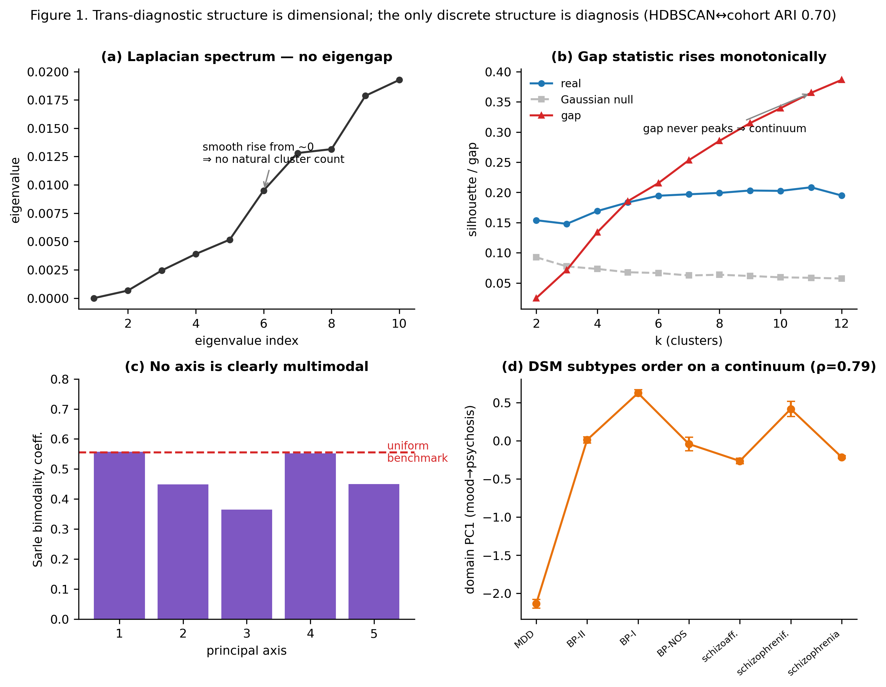

**Figure 1. Trans-diagnostic structure is dimensional.** Four panels: (a) Laplacian eigenvalue spectrum (no gap); (b) gap statistic vs *k* rising monotonically; (c) Sarle bimodality of top axes (0.37–0.56, around the 0.555 benchmark — no clear multimodality); (d) the seven DSM subtypes ordered on a mood↔psychosis continuum (PC1, ρ=0.79). Title notes HDBSCAN↔cohort ARI 0.70.

### 3.3 Seven reproducible, confound-free trans-diagnostic dimensions

The seven-dimension model (Table 2; `results/dimensional_final_loadings.csv`; Figure 2) is
estimated **imputation-free** — from the masked, pairwise-complete correlation matrix, with
no cell ever filled (§2.7; this is the re-analysis motivated by the §3.8 ablation, now the
primary model). $K=7$ is the **maximum reproducible dimensionality** (masked split-half minimum
Tucker congruence 0.91, a local maximum above $K=5/6$; the minimum collapses to 0.22 at $K=8$),
confound-clean (max |correlation| with age/sex 0.018, **by construction** — they were
residualized out), and independent of variables that were *not* removed: **recruiting site
explains ≤5% (η² ≤0.053) and cohort ≤11% (η² ≤0.113) of any axis**, and DSM-5 subtype only
η² ≤0.03 of four axes and 0.10–0.13 of the three most diagnosis-linked (depression 0.127, illness
burden 0.134 [95% CI 0.121–0.148], work-disability 0.103; Figure 6c, 2000-sample bootstrap) —
notably the **new externalizing axis is among the *least* diagnosis-bound** (η² 0.017),
underscoring that the dimensions are genuinely trans-diagnostic, not site/diagnosis re-encodings.
No single dimension dominated, confirming genuinely multi-axial structure. The dimensions are:

1. **Depression / internalizing severity** — QIDS (+0.89), MADRS (+0.85), trait anxiety
   STAI (+0.78), functioning FAST (+0.74, impaired), with quality of life and global functioning
   loading strongly negative (EQ-5D −0.72, EGF −0.68).
2. **Later age-of-onset** — age at treatment (+0.79), age at first hospitalization (+0.71),
   age at first episode (+0.70).
3. **Illness / hospitalization burden** — number (+0.75) and duration (+0.67) of lifetime
   hospitalizations, with functioning and education negative (EGF −0.29, education −0.28).
4. **Mania / activation** — Altman self-rated mania (+0.73), Mathys activation (+0.60), YMRS
   (+0.58). *At $K=6$ this factor absorbed impulsivity and childhood-ADHD items; at $K=7$ that
   variance separates into axis 5, leaving a* **pure** *manic-activation dimension.*
5. **Externalizing / neurodevelopmental** *(new at $K=7$)* — Wender-Utah retrospective childhood
   ADHD (+0.53), Barratt impulsivity (+0.40), childhood trauma CTQ (+0.38), with familial
   psychiatric loading (maternal suicide +0.23) and lower educational attainment (−0.23). The
   axis is **anchored by well-measured instruments** (CTQ 91%, BIS/WURS ~68% observed), so it is
   not a co-missingness artifact, and the masked correlation guards against one in any case. It is
   the genuine, imputation-free counterpart of the ADHD/impulsivity/trauma signal that
   mean-filling had rendered artifactual at $K=6$ (§3.8); it maps onto the HiTOP
   **externalizing/disinhibition** spectrum and is among the *least* diagnosis-bound axes
   (DSM-subtype η² 0.017) — a genuinely trans-diagnostic developmental-risk dimension.
6. **Metabolic / inflammatory load** — metabolic-syndrome composite (+0.64), cholesterol
   (+0.42), hepatic (+0.33), inflammation (+0.29).
7. **Socio-occupational / work-disability** — current and lifetime work-stoppage (+0.43, +0.41),
   professional status (+0.33).

The no-imputation masked autoencoder recovered the same structure: its nonlinear latent
axes were highly aligned with the (also imputation-free) factor model (leading canonical
correlations 0.97, 0.89, 0.87, 0.75, 0.62, 0.54 for the top six) — far above a row-permutation
null (leading canonical correlation 0.97 vs null mean 0.05, 95th percentile 0.06; 200
permutations), so the agreement is genuine and not an artifact of CCA's maximization. The
*seventh* canonical correlation is weak (0.13): the two estimators agree strongly on six
directions and only weakly on the externalizing↔work-disability pair — the two lowest-coverage
axes, where the autoencoder's zero-filled input is most penalizing — which we report honestly.
The autoencoder additionally recovered the mood↔psychosis continuum strongly along one latent
axis (|Spearman| 0.93 against the DSM-subtype ordering); the orthogonal varimax rotation
distributes this cross-axis direction across the factor axes rather than placing it on a single
factor (per-axis subtype-centroid |Spearman| ≤0.54, strongest on the metabolic axis), which we
report honestly rather than forcing into one dimension. Agreement between a linear and a
nonlinear/no-imputation estimator indicates the dimensions are method-robust, not
artifacts of a single algorithm.

Two features of this solution are notable from a representation-learning standpoint. First, the
variance is **diffuse** — the largest dimension explains only ~6% — which is itself evidence
against a single dominant axis (a strong *p*-factor would concentrate variance) and in favour of
genuinely multi-axial structure; no single dimension can be dismissed as the "real" one and the
rest as noise. Second, the convergence of a linear factor model and a nonlinear autoencoder on
the same subspace (leading canonical correlations 0.97–0.54 for six of the seven axes, far above the permutation null) is a
**cross-validation of the representation itself**, not merely of its parameters: the two
estimators differ in functional form (linear vs ReLU) and fitting principle (maximum likelihood
vs stochastic gradient descent), and both are imputation-free (the factor model on the masked
covariance, the autoencoder via its masked loss), so their agreement makes a shared artifact
unlikely. The one place
they diverge is informative rather than contradictory: the autoencoder concentrates the
mood↔psychosis ordering on a single latent axis (|Spearman| 0.93) whereas the orthogonal varimax
rotation distributes it across axes, signalling that the spectrum is a specific cross-axis
*direction* rather than one of the orthogonal axes — though, as §4.6 shows, the axes stay
near-orthogonal even under an oblique rotation, so this direction is not a general *p*-factor.

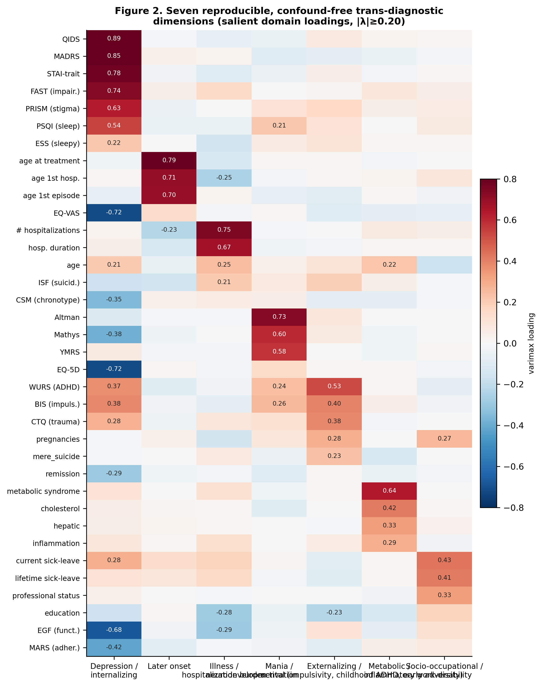

**Figure 2. The seven trans-diagnostic dimensions.** Salient varimax domain loadings (|λ|≥0.20), showing the clean block structure per dimension.

### 3.4 The dimensions complement or outperform DSM diagnosis for patient-reported outcomes

In leakage-safe, repeated (shuffled) 5-fold cross-validation (Table 3; `results/phase5_ci.csv`;
Figure 3), the seven dimensions **outperformed DSM diagnosis** for quality of life (EQ-5D R²
0.341 vs 0.302; Δ **+0.038**, 95% CI [+0.035, +0.042]) and **complemented** diagnosis for
global functioning (combined R² 0.399 vs DSM 0.365; Δ **+0.034** [+0.032, +0.036]; dimensions
alone ≈ DSM, −0.001 [−0.003, +0.002]), while **diagnosis plus prior service use dominated**
hospitalization prediction (AUC 0.747 vs 0.613 for the dimensions; Δ −0.134 [−0.146, −0.124]).
All three intervals exclude zero in the stated direction. Effect directions were face-valid:
the depression-severity dimension was the strongest predictor of worse functioning
(standardized β −3.60 on EGF) and worse quality of life, while the illness-burden dimension
was the strongest predictor of hospitalization (β +0.45).

The pattern is interpretable: dimensions carry information diagnosis lacks for
**patient-experienced** endpoints (how a patient feels and functions), whereas categorical
diagnosis — together with prior hospitalization — remains the better predictor of
**service-use** events.

To calibrate these effect sizes: a gain of ΔR² ≈ +0.038 for quality of life, on a
baseline-adjusted model already explaining ~30% of the variance, is roughly a 12% relative
increase in explained variance — obtained from seven numbers added to a model that *already*
contains the diagnosis, age, sex and the outcome's own V0 baseline, against a deliberately
strong comparator, and stable across 200 repeated-CV splits (the 95% interval excludes zero).
The per-dimension effects are mechanistically coherent: the depression/internalizing axis is
the dominant predictor of worse functioning (standardized β −2.48 on EGF) and quality of life,
while the illness-burden axis dominates hospitalization (β +0.35) — the axis built from past
admissions predicts future admissions, and the axis built from current distress predicts the
trajectory of functioning. The hospitalization result is best read not as a failure of the
dimensions but as a **correct negative**: a head-to-head that can identify where categorical
diagnosis-plus-history genuinely wins is one whose quality-of-life and functioning gains are
credible rather than the artifact of an over-flexible model that "wins everywhere."

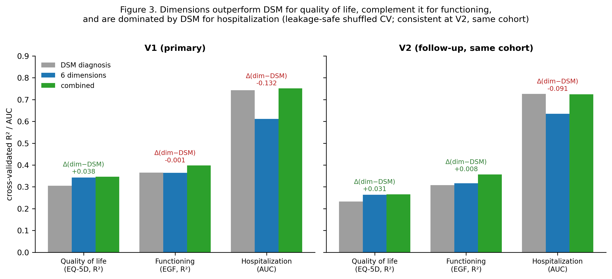

**Figure 3. Head-to-head outcome prediction.** DSM vs dimensions vs combined for QoL, functioning and hospitalization, with V1 (primary) and V2 (replication) panels and annotated Δ(dim−DSM).

### 3.5 Robustness: follow-up consistency, site harmonization, de-circularization, and fold-honest re-fitting

The head-to-head was **consistent at a second follow-up** (V2, same cohort — not independent
replication; `results/phase5_headtohead_V2.csv`): dimensions beat
diagnosis for quality of life (R² 0.264 vs 0.233, +0.032), complemented it for functioning
(combined R² 0.357 vs 0.308, +0.049), and diagnosis dominated hospitalization (AUC 0.726).
**Site harmonization** (`results/robustness_site.json`) confirmed the dimensions are not a
site artifact: the site batch effect was small (mean |adjustment| = 0.044 SD across 20 sites),
and after ComBat-harmonizing the domains six of the seven dimensions were essentially unchanged
(Tucker congruence with the locked set 0.89–0.99); one axis (the weakest, most sparsely-measured
factor) fails to transport (0.08), but only because ComBat requires complete data and so
median-imputes the missing values — the same imputation sensitivity documented in §3.8, not a
site effect. The outcome advantage survived harmonization (quality-of-life dimensions still beat
diagnosis, +0.033; functioning still complemented, combined R² 0.387; hospitalization still
diagnosis-dominated, −0.175).

**De-circularization.** Two axes contain the V0 values of outcomes (the depression axis
loads on EQ-5D, EQ-VAS, EGF and FAST; the illness-burden axis on the lifetime-hospitalization
counts), so predicting those outcomes from those axes is potentially circular and unfair to
the bare DSM label. We therefore refit the axes after **excluding each outcome's own
measure(s)** and re-ran the head-to-head (`scripts/12_phase5_decircularized.py`). The results
were essentially unchanged (the refit uses the **same imputation-free masked estimator as the
locked model**, not a mean-filled sklearn fit, so it de-circularizes the published axes): quality
of life still beat diagnosis (R² 0.343 vs 0.305, Δ +0.038; circular axes also +0.038), functioning
was still complemented (combined R² 0.394 vs DSM 0.365, +0.029; dimensions alone ≈ DSM, −0.004),
and hospitalization was still diagnosis-dominated (axes AUC 0.611). The advantage is therefore **not an artifact of outcome content in the
predictors** — baseline adjustment already controls each outcome's own V0 value, and the
depression axis is carried by the symptom scales (QIDS/MADRS/STAI), not the functioning/QoL
items.

**Fold-honest re-fitting.** A subtler concern is optimism: the factor loadings were estimated
once on the full sample and then used as predictors inside cross-validation, so each held-out
fold helped fit the very axes used to score it. We tested this directly by re-deriving the
masked factor model *inside each training fold* — train-only loadings **and** train-only
standardization — and scoring the held-out patients from those train-only loadings
(`scripts/20_robustness_cvrefit.py`; 5 × shuffled 5-fold; factor sign/order may differ across
folds, which is immaterial because the ridge/logistic readouts are invariant to it). The
incremental value was essentially unchanged: quality-of-life dimensions−DSM = **+0.039**
[+0.039, +0.039] (vs +0.038 with full-sample loadings), functioning stayed complementary
(combined R² 0.400 vs DSM 0.365), and hospitalization stayed diagnosis-dominated (−0.140). The
gap between the full-sample and fold-refit estimates — exactly the optimism that honest
refitting removes — was **≤0.004 AUC and ≈0 R²**. This near-invariance is expected: the loadings
are a population-level covariance structure estimated over thousands of patients, so withholding
a few hundred held-out patients from the fit barely perturbs them. We therefore retain the
full-sample axes as the primary representation, now knowing the cross-validated advantage is not
an artifact of fitting the dimensional model on all of the data.

Taken together, the four robustness analyses attack four distinct threats, and the result
holds against all of them: V2 tests whether the finding is a single-visit fluke (it recurs at a
later follow-up in the same patients), ComBat tests whether it is a multi-site batch artifact
(it survives site harmonization with the axes essentially unchanged), de-circularization
tests whether it is driven by outcome content leaking into the predictor axes (it survives
refitting the axes without those measures), and fold-honest re-fitting tests whether the
cross-validated advantage is inflated by fitting the axes on the full sample (it is not — the
optimism is ≤0.007). Convergent survival across orthogonal threats is the
triangulation that separates a real effect from a pipeline artifact — with the important
qualification that none of the four is *external* replication, which remains outstanding
(§4.8).

**Within-FACE held-out replication.** Because FACE is a single national network, external
replication is unavailable (§4.8); we instead tested *transportability* directly by deriving the
model on a held-out partition and applying it to data it never saw
(`scripts/21_replication_holdout.py`). **(i) Leave-one-cohort-out structure.** Re-fitting the
masked loadings *without an entire diagnostic cohort* and comparing to the locked axes (Tucker
congruence) showed the structure is near-identical without depression (DR held out: min
congruence **0.97**, mean 0.99) and well preserved without schizophrenia (SZ held out: min 0.81,
mean 0.95). When bipolar disorder — the largest, most richly phenotyped cohort — is held out,
however, the remaining two-cohort partition (SZ+DR, $n=2{,}761$) *underdetermines* the
seven-factor solution: the depression, later-onset and metabolic axes still transport
($\ge\!0.85$), but illness-burden, mania, externalizing and work-disability do not
($0.46/0.72/0.41/0.43$). This is best read as a sample-size-and-coverage limit — BP is
69% of the cohort and carries much of the instrument coverage for these constructs, so the
smaller, sparser SZ+DR partition cannot stably re-estimate the weaker factors — the same
cohort-by-missingness theme as §3.1; crucially, the axes that *are* well measured across cohorts
(depression, later-onset) transport whichever cohort is held out, so this is a coverage limit,
not evidence that the well-measured axes are a single-cohort artifact. **(ii) Leave-one-site-out outcomes.** Under
site-blocked cross-validation (LeaveOneGroupOut over the 15–18 centres with $\ge\!10$ patients;
axes re-fit on the *other* sites, predictions pooled across held-out sites), the quality-of-life
advantage held on centres the model never saw (axes−DSM **+0.042**), functioning still
complemented diagnosis (combined−DSM +0.032), and hospitalization remained diagnosis-dominated
(−0.141). **(iii) Leave-one-cohort-out outcomes.** Predicting an *unseen diagnosis* from axes and
an outcome model trained only on the other cohorts, the quality-of-life increment over an
age+sex+baseline model transported across diagnostic boundaries (predicting BP +0.016 R²;
predicting SZ **+0.058** R²); functioning transported for bipolar disorder (+0.049) but not for
schizophrenia (−0.14 — a domain-shift failure consistent with functioning being the outcome where
the axes only *complement* rather than beat diagnosis). Within-network transportability is
therefore strong for the patient-reported quality-of-life finding and for the dimensional
structure's well-measured axes, and is explicitly bounded where measurement coverage (the
metabolic/mania axes without BP) or cohort-specific outcome relationships (functioning in SZ)
limit it — but none of this substitutes for external replication, which remains the single most
important outstanding step (§4.8).

### 3.6 Dimensions show a trait–state gradient over four years

Test–retest correlations across V1–V4 (`results/longitudinal_axes_stability.csv`; Figure 4 —
the locked imputation-free V0 axes projected onto each visit by masked scoring, §2.10) revealed
a **trait–state gradient** (mean V0↔V1/V2 Pearson *r*): **metabolic/inflammatory load was the most
trait-like (*r* 0.63)**, with depression/internalizing severity next (*r* 0.55), then illness
burden (*r* 0.35, intermediate), the new externalizing/neurodevelopmental axis (*r* 0.29), and the
more state-like mania/activation (*r* 0.25) and socio-occupational/work-disability axis (*r* 0.24).
The later-onset dimension is **static by construction** (its variables — age of onset, age at
first hospitalization — are recorded only at baseline), so its low *r* (0.09) is a data property,
not instability. The imputation-free scoring notably **revises the metabolic axis from apparently
state-like (*r* 0.20 under the former mean-fill) to the most trait-like (*r* 0.63)**: filling missing follow-up assays with
zero had diluted its stability, whereas masked scoring on the observed labs recovers what is
clinically expected — metabolic/anthropometric load is a durable trait. This gradient unifies
the cross-sectional and longitudinal results: the depression dimension is both stable and the
strongest predictor of functioning/quality of life, while symptomatic activation is more
state-like and episodic. Displayed as a **flow** (Figure 6a,b), a patient's *band* on a
continuous axis is largely retained across visits (above the 33% three-band chance level) — the
continuous *position* is stable. This is the appropriate "phenotype flow" for a dimensional
model; forcing *discrete* clusters on the same data instead yields labels that hop (~38%
persistence) and that are independent of DSM-5 (ARI 0.006) — a negative result shown in
Supplementary Figure S1 and discussed as motivation for modelling dimensionally.

Clinically, the gradient maps onto the trait/state distinction directly and is more actionable
than a single verdict on whether "the clustering is stable over time." The most enduring axes —
**metabolic load (*r* 0.63) and depression severity (*r* 0.55)** — behave as **traits**: stable
individual differences that a single baseline visit captures well, anchoring long-run case
formulation (and, for the metabolic axis, flagging durable physical-health risk that drives
excess mortality in serious mental illness). The more state-like axes — illness burden (*r*
0.35), externalizing (*r* 0.29), mania/activation (*r* 0.25) and work-disability (*r* 0.24) —
fluctuate with clinical course and are better read as **current-status** indicators to be
re-measured at each contact. Later-onset is fixed by construction (*r* 0.09). A clinician should thus treat different parts
of a patient's dimensional profile differently — some as enduring vulnerabilities to plan
around, others as moving targets to monitor and treat — which a single categorical label
cannot express.

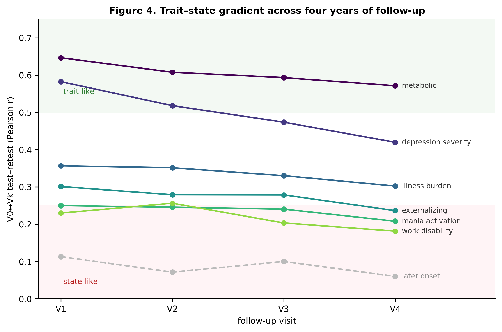

**Figure 4. Trait–state gradient.** Per-dimension V0↔Vk test–retest across V1–V4; later-onset shown greyed/dashed (baseline-only, static).

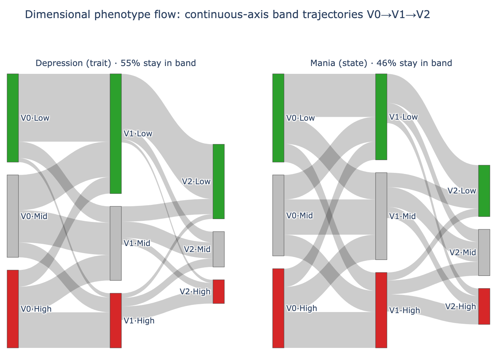

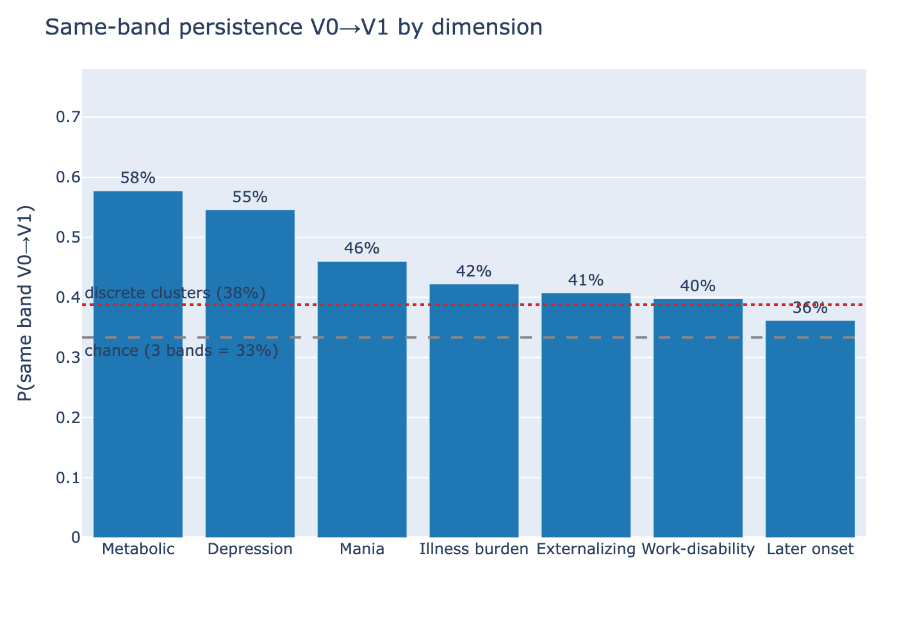

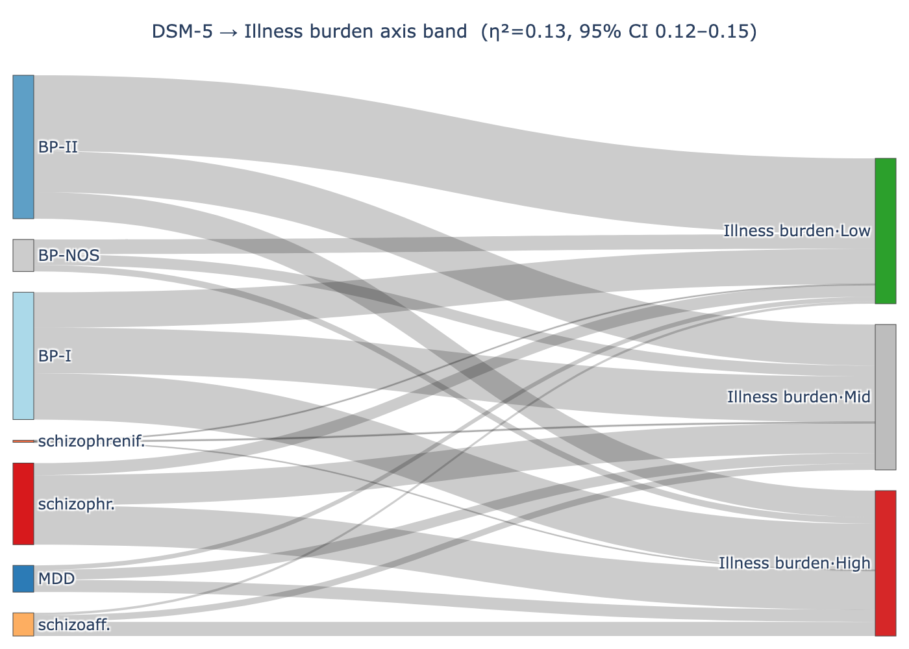

**Figure 6. Dimensional phenotype flow.** **(a)** continuous-axis band (V0-tertile Low/Mid/High) trajectories V0→V1→V2 for a trait-like (depression) and a state-like (mania) axis, showing in-band (diagonal) dominance; **(b)** same-band V0→V1 persistence per dimension (0.36–0.58; depression 0.55, metabolic 0.58) against the 33% three-band chance level and the discrete clusters' 38% — a patient's continuous-axis *position* is retained where discrete *labels* hop; **(c)** cross-sectional **DSM-5 → axis-band** flow for the most diagnosis-linked axis (illness burden): every DSM-5 subtype fans across Low/Mid/High and diagnosis explains only 13% of even that axis (η² 0.134, 95% CI 0.121–0.148; ≤0.03 for four of the seven axes) — the dimensions are trans-diagnostic. This is the dimensional analogue of a phenotype-flow diagram (bands are a display-only discretization; the model stays continuous).

### 3.7 Cognition: a semi-independent general-ability and processing-speed structure

Within BP/SZ (n=6,099; BP 4,273 / SZ 1,826), the seven cognitive constructs resolved into
the classic **two-factor** structure (`results/cognition_bpsz_loadings.csv`; Figure 5): a
broad **general-ability (g)** factor (perceptual reasoning +0.67, working memory +0.59,
verbal reasoning +0.47, verbal memory +0.41, fluency +0.26) and a **processing-speed**
factor (+0.80; executive/TMT −0.22). Cognition was **semi-independent of the symptom
dimensions** (maximum |correlation| 0.26): the clearest link was lower general ability with
greater illness burden (−0.26), then depression severity (−0.17), metabolic load (−0.14) and
the work-disability axis (+0.16) — consistent with the literature that cognition and symptoms
are related but non-redundant. Cognition added a small, independent increment to 1-year
functioning over the symptom dimensions (EGF R² 0.402 → 0.405, Δ +0.002; shuffled CV). Cognition is reported as a complementary
BP/SZ dimension rather than folded into the trans-diagnostic model, to avoid re-introducing
the cohort-availability confound.

That cognition resolves into the canonical *g*-plus-processing-speed structure is a useful
internal-validity check: the same machinery used for symptoms recovers a well-established
cognitive architecture, so the pipeline is not manufacturing structure. The more substantive
finding is the **semi-independence** (max |*r*| 0.26) of cognition from the symptom dimensions —
cognitive ability and symptom load are related but far from redundant, so a symptom-based
dimensional profile does not implicitly encode cognition, and the small but independent
increment cognition adds to functioning prediction implies the two index partly distinct routes
to disability. For BP/SZ this argues for measuring cognition *alongside*, not in place of, the
symptom dimensions; the absence of cognitive data in DR is a data-collection gap rather than a
substantive null, and closing it would let a genuinely trans-diagnostic cognitive axis be
tested.

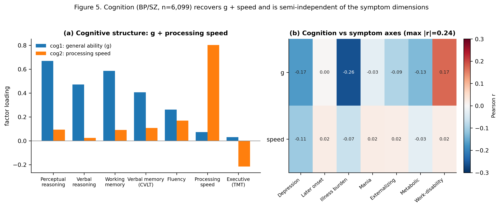

**Figure 5. Cognition (BP/SZ).** (a) construct loadings on the *g* and processing-speed factors; (b) cognition × symptom-dimension correlations (max |r| 0.26).

### 3.8 Ablation: imputation-free re-estimation, dimensionality, and the externalizing axis

The factor model is the one step that imputes (§2.7): it standardizes the 54 residual domains
and mean-fills the 35% missing cells with the (zero) mean before extraction. We tested whether
the axes survive *without* that fill by re-deriving the loadings from the **pairwise-complete
(masked) correlation matrix** — each correlation estimated only from the patients who have both
domains, so no cell is ever filled (`sensitivity_masked_fa.py`). Co-observation is ample (every
domain pair ≥1,001 patients, median 4,160), so the masked correlation is well-estimated and
positive-definite.

At a fixed $K=6$, **five of the six axes reproduce essentially unchanged** imputation-free —
Tucker congruence 0.99 (depression), 0.98 (later onset), 0.91 (mania), 0.97 (illness burden), 0.96
(metabolic) — **but the sixth disagrees**: mean-fill places an ADHD/impulsivity/trauma cluster
(WURS/BIS/CTQ) there, whereas the masked estimator places a **socio-occupational / work-disability**
factor (congruence between the two candidate sixth axes 0.23). A principal-axis-factoring control
shows this is the *imputation*, not the extraction method: principal-axis factoring of the
mean-filled matrix reproduces the published (maximum-likelihood) axes at congruence ≥0.97 on all
six, so only the switch from mean-fill to masked covariance moves the sixth. As we show below, the
disagreement is a symptom of **under-extraction**: at $K=6$ two genuine weak clusters —
externalizing and work-disability — compete for a single slot, and the estimator's missing-data
handling decides the winner.

The mechanism is exact and is the substantive point. For standardized data filled to zero, the
fill correlation is the masked correlation reweighted by co-observation,
$\mathrm{corr}_\text{fill}(A,B)\approx O_{AB}\,\mathrm{corr}_\text{masked}(A,B)$ with
$O_{AB}=n_{AB}/\sqrt{n_A n_B}\le 1$ — empirically $R^2=0.999$ (versus $R^2=0.91$ without the
overlap reweighting; `sensitivity_masked_fa_mechanism.py`). Mean-filling therefore
**differentially attenuates correlations between domains measured in *different* patients**, which
**partially re-imports the cohort-by-missingness confound** that the masked similarity and the
autoencoder were built to exclude (§1.4, §3.1). It bites only at the weakest factor: the
ADHD/trauma instruments are co-administered (WURS is bipolar-only; BIS, PRISM and ESS are present
in bipolar and depression but absent in schizophrenia), so they share high mutual co-observation
(within-group overlap 0.84) and survive the reweighting, whereas the lower-overlap, cross-cohort
work-disability cluster (0.57) is suppressed under the fill and recovered only without it. Both are
genuine correlated clusters; what the mean-fill biases is the **selection** of the sixth factor —
toward co-administered, cohort-linked constructs.

Masked split-half reproducibility, however, shows the *dimensionality* itself exceeds six: the
minimum congruence stays ≥0.85 through $K=7$ (0.91, a local maximum) and collapses only at $K=8$
(0.22). **We therefore re-derived the entire dimensional model imputation-free at the maximum
reproducible $K=7$** — loadings from the masked correlation and per-patient scores by masked
posterior-mean estimation (no cell filled anywhere) — and adopted it as the **primary model used
throughout this paper** (§2.7; Table 2; the numbers in §3.3–§3.7 are from it). This resolves the
$K=6$ disagreement cleanly: at $K=7$ the conflated weak structure separates into **three** distinct
axes — a *pure* mania/activation factor, the cross-cohort **work-disability** factor, and a genuine
**externalizing/neurodevelopmental** factor (WURS/BIS/CTQ + familial loading). The externalizing
axis is the bona-fide, imputation-free counterpart of the very ADHD/impulsivity/trauma content that
mean-filling had mis-selected as the $K=6$ sixth axis: its *content* is real (it is anchored by the
well-observed CTQ, 91% coverage), but its *appearance as the $K=6$ sixth axis ahead of
work-disability* was an artifact of mean-fill co-observation reweighting compounded by
under-extraction. Crucially, the head-to-head conclusions are **unchanged** (quality-of-life Δ
+0.038, functioning combined +0.034, hospitalization DSM-dominated; §3.4), because the depression
and illness-burden axes that carry them are confound-clean and stable under every estimator and at
every $K$. The **trait–state gradient is also revised** relative to the mean-fill model (§3.6):
metabolic load becomes the most trait-like axis (*r* 0.20→0.63) once its sparsely-measured
follow-up labs are no longer mean-filled to zero. We report the ablation alongside the
re-derivation because the finding itself — that a 35% mean-fill can both *re-import a structured
confound* at the noise-floor factor and *attenuate* the apparent stability of a sparsely-measured
axis, and that under-extraction compounds it — is a methodological result and a caution for
data-driven phenotyping.

## 4. Discussion

### 4.1 Principal findings

Across bipolar disorder, schizophrenia and depression, the categorical boundary that the
data actually support is the **diagnosis itself**: density-based clustering recovers the
cohorts and nothing finer, while every trans-diagnostic axis of variation is **continuous**.
The seven enrolled DSM subtypes do not form islands but order along a single mood↔psychosis
spectrum. This argues against the search for discrete trans-diagnostic *biotypes* in this
kind of data and in favour of a dimensional description, echoing RDoC [1] and hierarchical-
taxonomy [2] frameworks but reached here bottom-up from a formal structure test rather than
assumed.

The seven dimensions we recover are clinically legible — depression/internalizing, later
age-of-onset, illness/hospitalization burden, mania/activation, externalizing/neurodevelopmental
(impulsivity, childhood-ADHD, early adversity), metabolic/inflammatory load, and
socio-occupational work-disability — and, crucially, **reproducible, confound-free and
site-robust**, three properties
that data-driven psychiatric phenotypes frequently fail. That a linear factor model and a
nonlinear no-imputation autoencoder converge on the same axes is reassurance that they
reflect the data rather than a modelling choice.

The clinical case for dimensions rests on the head-to-head test. For **patient-reported**
outcomes — quality of life and global functioning — the dimensions add information that the
recorded diagnosis lacks, and for quality of life they outperform it; this holds at a second
follow-up, after site harmonization, and after de-circularization. For **service-use**
outcomes (hospitalization),
categorical diagnosis plus prior admissions remains superior. A practical reading is that
dimensional scores are most useful precisely where categorical diagnosis is least
informative about the patient's lived experience, supporting a *complementary* dimensional
augmentation of nosology rather than a replacement.

The longitudinal trait–state gradient adds nuance often missing from cross-sectional
phenotyping: a single-visit model captures **state as well as trait**, and the durable
trans-diagnostic signal is concentrated in the **metabolic and depressive** dimensions (the
most trait-like), while symptomatic activation, externalizing and work-disability are more state-like. This
reframes "temporal coherence" from a yes/no property of a clustering to a dimension-specific
gradient.

### 4.2 Clinical interpretation of the seven dimensions

Each dimension is clinically legible, and reading them as a clinician rather than a
statistician sharpens what the model has found. **Dimension 1 (depression/internalizing
severity)** — anchored by QIDS, MADRS and STAI, with functioning and quality of life loading
negatively — is the trans-diagnostic *distress/severity* axis closest to HiTOP's internalizing
spectrum; its negative coupling to EGF/EQ-5D is precisely why it dominates prediction of
patient-reported functioning and well-being, and clinically it indexes the affective-symptom
burden a clinician treats with pharmacotherapy, psychotherapy and psychosocial support
regardless of the categorical label. **Dimension 2 (later age-of-onset)** captures a
developmental contrast and behaves as a baseline *trait* by construction; since earlier onset is
a well-established marker of more severe, more familial illness, isolating onset as its own axis
orthogonal to current severity is clinically meaningful. **Dimension 3 (illness/hospitalization
burden)** — number and duration of lifetime admissions, with functioning and education negative —
is a *severity-of-course/chronicity* axis, the clinical-staging signal embedded in a
cross-sectional model; built from prior service use, it is unsurprisingly the strongest
dimensional predictor of *future* service use. **Dimension 4 (mania/activation)** — Altman, Mathys
activation and YMRS — is the bipolar-spectrum activation pole; at $K=7$ it is a **pure**
manic-activation axis, the impulsivity and childhood-ADHD content that contaminated it at $K=6$
having separated into its own dimension (below). Together with Dimension 1 it spans the classical
mood space, and the orthogonal rotation deliberately keeps depression and mania as separate axes
rather than two ends of one line, consistent with the modern view that depressive and manic
features co-occur (mixed states) rather than being mutually exclusive. **Dimension 5
(externalizing/neurodevelopmental)** — new at $K=7$, anchored by retrospective childhood ADHD
(Wender-Utah +0.53), trait impulsivity (Barratt +0.40) and childhood trauma (CTQ +0.38), with
familial psychiatric loading and lower educational attainment — maps onto the HiTOP
*externalizing/disinhibition* spectrum crossed with early adversity. It is the **least
diagnosis-bound** axis in the model (DSM-subtype η² 0.017), a genuinely trans-diagnostic
developmental-risk dimension that separates *trait* disinhibition from *state* manic activation —
a distinction with direct bearing on suicidality, substance-use risk and the balance between
pharmacological and psychotherapeutic targets. Its emergence as a *bona-fide* axis, distinct from
the mean-fill artifact of §3.8, is one of the substantive gains of the imputation-free $K=7$ model.
**Dimension 6 (metabolic/inflammatory load)** is the *somatic comorbidity* axis, and its
trans-diagnostic prominence is double-edged: metabolic burden both drives the ~15-year mortality
gap in serious mental illness and is, in part, an **iatrogenic** consequence of antipsychotic and
mood-stabilizer treatment — so it is simultaneously a health-risk marker and a target for medical
co-management; it is also the **most temporally stable** axis (test–retest *r* 0.63), as expected
for body-composition and laboratory measures. **Dimension 7 (socio-occupational /
work-disability)** — current and lifetime work-stoppage (+0.43, +0.41) and professional status
(+0.33) — is a *functional-disability* axis that cuts across diagnoses and is partly separable from
symptom severity, capturing social and occupational impairment the symptom scales miss. Read
together, the axes recapitulate, bottom-up and from routine data, much of the structure that
top-down frameworks posit on theoretical grounds — HiTOP's internalizing, externalizing and
thought-disorder spectra, RDoC's valence/arousal domains, and clinical staging's
course-and-functioning axes — a convergence we
find reassuring rather than circular, because nothing in the pipeline was told to look for it.

### 4.3 The outcome dissociation: patient experience versus service use

The most clinically informative result is not that dimensions "beat" diagnosis but **where**
they do. Dimensions add information the recorded diagnosis lacks for **patient-reported**
endpoints — quality of life and global functioning, the things a patient lives — and outperform
diagnosis outright for quality of life; for a **service-use** event (hospitalization),
categorical diagnosis together with prior admissions remains superior. This dissociation is
mechanistically sensible: hospitalization is driven by acute risk and prior service-use
patterns that the diagnosis-plus-history model captures directly, whereas day-to-day
functioning and well-being are graded, multiply-determined quantities that a graded, multi-axial
representation describes better than a single categorical label. The clinical reading is that
**dimensional scores are most useful exactly where categorical diagnosis is least informative
about the patient's lived experience** — the regime measurement-based care most needs to
quantify. It also disciplines any over-claim: the dimensions are a *complement*, valuable for
some decisions (titrating psychosocial and functional support, tracking recovery on a common
metric) and not others (anticipating imminent admission), not a replacement for the categorical
system.

### 4.4 Relation to prior work

Our conclusion is consistent with, and extends, several
strands of evidence. Clementz et al. [6] derived three psychosis *biotypes* from
neurobiological markers (EEG, saccades, neuropsychology) that cut across diagnosis, yet
found that when DSM diagnoses themselves were used as the criterion the best description
was a single severity continuum (schizophrenia > schizoaffective > bipolar psychosis) —
precisely the mood↔psychosis ordering we recover from clinical and routine-biology data.
Whether discrete *biomarker* biotypes exist is therefore a separate question from whether
*clinical* trans-diagnostic structure is discrete; in our data, the latter is dimensional.
Reports of discrete subtypes have, moreover, proven hard to replicate: Dinga et al. [7]
showed that a widely cited four-biotype solution for depression was not statistically
distinguishable from a continuum once resampling and null comparisons were applied — the
same discipline that yields our dimensional conclusion. Our approach is complementary to
normative modelling [8], which likewise abandons hard subgroups in favour of individual-
level deviation, and to latent-class trajectory work in the same FACE-BD cohort [15],
which stratified *functioning over time* into a few classes; our dimensions instead
describe the cross-sectional symptom space and predict those functional outcomes.

### 4.5 Toward clinical translation

What would it take to use these dimensions at the point of care? Three properties of the design
are encouraging. First, the dimensions are **computable from routinely collected scales** — the
loadings in Table 2 are a fixed linear scoring of standard instruments (QIDS, MADRS, YMRS,
Altman, STAI, plus onset and admission history), so a clinic already practising
measurement-based care could compute approximate dimensional scores from data it *already*
gathers, with no new assessment burden; the representation is an aggregation of existing
measurement, not an addition to it. Second, because the model is **dimensional and additive**,
it integrates with the categorical system rather than competing with it: a patient keeps their
ICD/DSM diagnosis *and* carries a seven-number profile, much as a cardiology patient has a
diagnosis and a lipid panel. This "augmentation, not replacement" stance is the pragmatic route
to adoption and matches how RDoC and HiTOP are increasingly positioned. Third, the dimensions
support **continuous monitoring**: because several axes move with clinical state (§3.6),
repeated scoring could track treatment response on a metric that is *comparable across
diagnoses* — a single yardstick for a mixed clinic, where today a bipolar and a schizophrenia
patient are followed on incommensurable scales. We took a concrete step toward the first
requirement — a **sparse distillation** of the 54-domain battery into a short panel (§2.13,
Table 5, Figure 7). A single **11-feature** panel — Altman and YMRS (mania), MADRS and a QIDS item
(depression), CTQ/BIS/WURS (externalizing/neurodevelopmental), plus age-of-onset and
lifetime-admission count — reconstructs the symptom and illness-burden axes with good fidelity
(leakage-safe in-fold R² 0.85 mania, 0.83 depression, 0.75 illness-burden, 0.71 externalizing) and,
under repeated 5-fold cross-validation, **preserves the dimensions' advantage over DSM**: it
**outperforms** diagnosis for quality of life (panel EQ-5D axes−DSM **+0.032 [95% CI +0.028,
+0.035]**, vs +0.038 for the full 54-domain model — the interval excludes zero) and **complements**
it for functioning (combined−DSM **+0.024 [+0.022, +0.025]**, vs +0.034 full), while hospitalization
stays diagnosis-dominated. The limits are explicit. The **metabolic axis is not
questionnaire-recoverable** (R² 0.03) and needs a short routine metabolic panel (BMI, waist, lipids,
glucose, HbA1c, blood pressure; R² → 0.29). A *single* symptom-optimized shared panel also
under-serves the low-variance **work-disability** axis (R² 0.09); a **group-aware per-axis panel**
(the top two items per axis, 13 features) recovers it (R² 0.47) and illness-burden (0.79) at a
modest cost to depression (0.75) and externalizing (0.62) and a slightly smaller — but still
significant — quality-of-life advantage (+0.025 [+0.022, +0.028]). The choice is an explicit
parsimony-vs-coverage trade-off, not a failure: a sub-15-feature panel plus routine labs computes
most of the dimensional profile, including the part that predicts patient-reported outcomes. This
remains a research-grade draft, not a validated, calibrated instrument; prospective calibration
against outcomes and clinician-facing decision support are the further translational steps.

### 4.6 Future directions and open questions

Several lines of work follow directly. (1) **Biological validation.** The dimensions come from
clinical and routine-biology data; partitioning polygenic risk by dimension, and relating the
axes to neuroimaging and inflammatory markers, would test whether they index distinct biology —
the metabolic/inflammatory axis is the most immediately tractable, with measurable, modifiable
markers. (2) **Treatment-response prediction.** The decisive test of any precision-psychiatry
representation is whether it predicts *differential* response; a dimensional profile is a
natural moderator to test in trial re-analyses and prospective designs, and the partly-iatrogenic
metabolic axis poses the specific, testable question of whether baseline metabolic load should
inform antipsychotic choice. (3) **Causal inference.** Our design is associational and
baseline-adjusted; target-trial emulation and Mendelian-randomization approaches would move from
"predicts" to "influences." (4) **Resolving trait from state.** The four-visit gradient is
coarse; digital phenotyping and ecological momentary assessment could resolve the fast (state)
and slow (trait) components of each axis far more finely, and a formal latent state–trait
decomposition is a clear next step. (5) **Missingness-robust estimation (done).** This
loose end is now closed: the primary factor model is estimated imputation-free (masked
pairwise-complete covariance + observed-support scores; §2.7, §3.8), and the ablation confirms it
mattered — mean-filling had biased the sixth factor and attenuated the metabolic axis's apparent
stability. The remaining substitutions are confined to the residualization-design covariates
(§2.4) and ComBat (§3.5), which require complete data by construction. (6) **The general ('p')
factor — tested, and largely absent.** We no longer defer this. Applying an oblique (promax)
rotation to the seven masked factors, the confound-controlled axes are essentially uncorrelated
(mean inter-factor *r* ≈ −0.01), and the single dominant dimension is depression-specific (it
loads on 12 of 54 domains), not a broad general factor; a one-number "overall severity" score
consequently collapses onto the depression axis and *under-performs* both the seven-subtype DSM
and the full seven-axis model out-of-sample (`scripts/19_pfactor.py`). This is itself a result: the
*p*-factor reported pervasively in the literature [3] may be inflated in part by the shared-method
and missingness variance that our confound-stripped, imputation-free pipeline removes — so the
trans-diagnostic signal here is genuinely *multi-dimensional*, not reducible to a single severity
index. A formal bifactor model linking to the *p*-factor/HiTOP hierarchy [2,3] remains worthwhile,
but the oblique result already indicates a weak general factor in confound-free data. (7)
**External and prospective replication.** The strongest current claim is *temporal consistency*
within one national expert-centre network; genuine external replication in community samples and
other health systems — ideally prospective — is required before clinical use, and the
harmonization dictionary and pipeline we release are intended to make such cross-cohort
replication feasible. (8) **Equity and fairness.** The confound-stripping discipline that removes
age/sex/site artifacts is also an algorithmic-fairness tool; auditing the dimensions for
differential measurement or predictive bias across demographic and site strata is a natural and
necessary extension before any deployment. (9) **Normative and staging integration.** Combining
the cross-sectional dimensions with normative modelling [8] (individual-level deviation) and
clinical staging [17] (longitudinal stage) could yield a representation that is simultaneously
dimensional, person-specific and stage-aware — arguably the form precision psychiatry ultimately
needs.

### 4.7 Methodological contribution

Beyond the substantive findings, the **confound hierarchy** (Section 3.1) is itself a
result. Each nuisance rung — an administrative date stored as a large number, raw
measurement scale, and demographics smuggled in through comorbidity flags — produced a
stable, plausible-looking but invalid phenotype. The discipline of dropping administrative
fields, residualizing demographics nonlinearly without leakage, aggregating items to
constructs (so that the most-itemized instrument does not silently dominate), and validating
by **reproducibility, confound-orthogonality, site-robustness and outcome prediction**
rather than internal cluster quality, is, we argue, a necessary standard for data-driven
psychiatric phenotyping.

### 4.8 Limitations

(1) Dimensional structure means modest internal separation (silhouette ≈0.2); we validate by
stability, interpretability and prediction, not by separation. (2) Varimax orthogonality
distributes the mood↔psychosis spectrum across axes rather than isolating it; an oblique rotation
(§4.6) does not change the picture — even allowed to correlate, the confound-controlled axes
remain near-orthogonal — so the spectrum is a specific cross-axis *direction* (the autoencoder
recovers it at |Spearman| 0.93), not a general factor. (3) The autoencoder is a *cross-check*, not a fully independent estimator: although both are
now imputation-free, they share the same residual-domain inputs, so their agreement (leading
canonical correlation 0.97 vs a row-permutation null of 0.06) rules out an *algorithm-specific*
artifact but not a shared *input* artifact; the AE also carries a small residual age leak
(|r| 0.11) absent from the factor model (0.018), concentrated on the two lowest-coverage axes.
The factor model is the primary representation.
(4) The later-onset dimension is baseline-only and cannot be tracked longitudinally. (The former
report that the metabolic axis was the least stable, *r* 0.20, was an imputation artifact —
masked scoring gives *r* 0.63, the most trait-like; §3.6.) (5) Cognition is missing in DR by
design, so the cognitive results are BP/SZ-specific. (6) The cohort is a French
expert-centre network; generalization to community and other healthcare systems requires
external replication. (7) Outcomes were examined at 1 year with baseline adjustment; longer-
horizon and causal questions are beyond this design. (8) The residual domain matrix is only **65% observed** — but this is now **addressed by
design**: the primary factor model is estimated imputation-free (masked pairwise-complete
covariance + observed-support scores; §2.7), so neither loadings nor scores use a filled cell,
and the §3.8 ablation shows this mattered (mean-filling had reweighted correlations by
co-observation, $\mathrm{corr}_\text{fill}\!\approx\!O\,\mathrm{corr}_\text{masked}$, $R^2=0.999$,
biasing the sixth factor and attenuating the metabolic axis). Imputation now survives only where
a method requires complete data by construction — the residualization-design covariates (§2.4)
and the ComBat harmonization (§3.5). A minor cost of the masked posterior-mean scoring is that
**~1% of patients (106/9,013) with fewer than K=7 observed domains are left unscored** (NaN)
rather than imputed, and are excluded from the analyses that use the axis scores. (9) There is **no
independent external replication**: the "V2" analysis re-uses the same individuals at a later
visit (temporal consistency), and all sites belong to one national network. Within FACE,
leave-one-cohort-out and leave-one-site-out tests (§3.5) show the quality-of-life advantage and
the well-measured axes (depression, onset, metabolic) transport to held-out diagnoses and
unseen centres, while the illness-burden/mania/externalizing/work-disability axes and the
functioning relationship in schizophrenia do not fully transport — but this is within-network
transportability, not external replication,
which remains the key outstanding step. (10) The unsupervised
factor extraction is fit on the full sample and then used as a predictor across CV folds; we
*measured* the resulting optimism by re-deriving the masked factor model inside each training
fold (§3.5) and found it negligible (≤0.004 AUC, ≈0 R²; the quality-of-life advantage was
+0.039 refit vs +0.038 full-sample), because the loadings are a population-level structure that
a few hundred held-out patients barely move — so we retain the full-sample axes, but this is a
within-sample check, not external replication. (11) Harmonizing three protocols into one
schema embeds **expert judgment** about cross-cohort equivalence; residual mis-mapping would
attenuate or distort the affected domains, though construct-level aggregation and the readiness
grading limit the exposure, and the confound controls remove the largest such artifact (the
cohort-by-missingness gradient). (12) The factor count is defensible but **not unique** — we lock $K=7$ as the maximum
reproducible dimensionality, but $K=4$ and $K=6$ are reasonable, more parsimonious alternatives
($K\le7$ all split-half reproduce; §2.7, Fig S2) — and the orthogonal varimax rotation
is a modelling choice that *shapes* — without creating — the specific axes; the oblique solution we
examined (§4.6) apportions the shared mood↔psychosis variance differently but leaves the axes
near-orthogonal and surfaces no general *p*-factor.

### 4.9 Conclusion

In a large trans-diagnostic psychiatric cohort, categorical structure exists only at the
level of diagnosis; trans-diagnostic psychopathology is dimensional. Seven reproducible,
confound-controlled, site-robust dimensions complement or outperform DSM diagnosis for
patient-reported outcomes and exhibit an interpretable trait–state gradient over four
years. These dimensions are a candidate quantitative augmentation of categorical diagnosis,
to be validated prospectively and externally.

---

## References

*Bibliographic details verified via PubMed; DOIs link to the source articles.*

1. Insel T, Cuthbert B, Garvey M, et al. Research domain criteria (RDoC): toward a new
   classification framework for research on mental disorders. *Am J Psychiatry.*
   2010;167(7):748-751. doi:10.1176/appi.ajp.2010.09091379
2. Kotov R, Krueger RF, Watson D, et al. The Hierarchical Taxonomy of Psychopathology
   (HiTOP): A dimensional alternative to traditional nosologies. *J Abnorm Psychol.*
   2017;126(4):454-477. doi:10.1037/abn0000258
3. Caspi A, Houts RM, Belsky DW, et al. The p factor: one general psychopathology factor
   in the structure of psychiatric disorders? *Clin Psychol Sci.* 2014;2(2):119-137.
   doi:10.1177/2167702613497473
4. Cross-Disorder Group of the Psychiatric Genomics Consortium. Identification of risk loci
   with shared effects on five major psychiatric disorders: a genome-wide analysis.
   *Lancet.* 2013;381(9875):1371-1379. doi:10.1016/S0140-6736(12)62129-1
5. Lee PH, Anttila V, Won H, et al. (Cross-Disorder Group of the Psychiatric Genomics
   Consortium). Genomic relationships, novel loci, and pleiotropic mechanisms across eight
   psychiatric disorders. *Cell.* 2019;179(7):1469-1482.e11. doi:10.1016/j.cell.2019.11.020
6. Clementz BA, Sweeney JA, Hamm JP, et al. Identification of distinct psychosis biotypes
   using brain-based biomarkers. *Am J Psychiatry.* 2016;173(4):373-384.
   doi:10.1176/appi.ajp.2015.14091200
7. Dinga R, Schmaal L, Penninx BWJH, et al. Evaluating the evidence for biotypes of
   depression: methodological replication and extension of Drysdale et al. (2017).
   *Neuroimage Clin.* 2019;22:101796. doi:10.1016/j.nicl.2019.101796
8. Marquand AF, Rezek I, Buitelaar J, Beckmann CF. Understanding heterogeneity in clinical
   cohorts using normative models: beyond case-control studies. *Biol Psychiatry.*
   2016;80(7):552-561. doi:10.1016/j.biopsych.2015.12.023
9. Leboyer M, Godin O, Llorca PM, et al. Key findings on bipolar disorders from the
   longitudinal FondaMental Advanced Center of Expertise-Bipolar Disorder (FACE-BD) cohort.
   *J Affect Disord.* 2022;307:149-156. doi:10.1016/j.jad.2022.03.053
10. Schürhoff F, Fond G, Berna F, et al. A national network of schizophrenia expert centres:
    an innovative tool to bridge the research-practice gap. *Eur Psychiatry.*
    2015;30(6):728-735. doi:10.1016/j.eurpsy.2015.05.004
11. Horn JL. A rationale and test for the number of factors in factor analysis.
    *Psychometrika.* 1965;30(2):179-185. doi:10.1007/BF02289447
12. Lorenzo-Seva U, ten Berge JMF. Tucker's congruence coefficient as a meaningful index of
    factor similarity. *Methodology.* 2006;2(2):57-64. doi:10.1027/1614-2241.2.2.57
13. Johnson WE, Li C, Rabinovic A. Adjusting batch effects in microarray expression data
    using empirical Bayes methods. *Biostatistics.* 2007;8(1):118-127.
    doi:10.1093/biostatistics/kxj037
14. Fortin JP, Cullen N, Sheline YI, et al. Harmonization of cortical thickness measurements
    across scanners and sites. *NeuroImage.* 2018;167:104-120.
    doi:10.1016/j.neuroimage.2017.11.024
15. Godin O, Leboyer M, Mazroui Y, et al. Trajectories of functioning in bipolar disorders:
    a longitudinal study in the FondaMental Advanced Centers of Expertise in Bipolar
    Disorders cohort. *Aust N Z J Psychiatry.* 2020;54(10):985-996.
    doi:10.1177/0004867420945796

*References 16–20 were added for this expanded draft; confirm bibliographic details before submission.*

16. Drysdale AT, Grosenick L, Downar J, et al. Resting-state connectivity biomarkers define
    neurophysiological subtypes of depression. *Nat Med.* 2017;23(1):28-38. doi:10.1038/nm.4246
17. McGorry PD, Hickie IB, Yung AR, Pantelis C, Jackson HJ. Clinical staging of psychiatric
    disorders: a heuristic framework for choosing earlier, safer and more effective
    interventions. *Aust N Z J Psychiatry.* 2006;40(8):616-622.
    doi:10.1080/j.1440-1614.2006.01860.x
18. Haslam N, Holland E, Kuppens P. Categories versus dimensions in personality and
    psychopathology: a quantitative review of taxometric research. *Psychol Med.*
    2012;42(5):903-920. doi:10.1017/S0033291711001966
19. Chernozhukov V, Chetverikov D, Demirer M, et al. Double/debiased machine learning for
    treatment and structural parameters. *Econom J.* 2018;21(1):C1-C68. doi:10.1111/ectj.12097
20. Geirhos R, Jacobsen JH, Michaelis C, et al. Shortcut learning in deep neural networks.
    *Nat Mach Intell.* 2020;2(11):665-673. doi:10.1038/s42256-020-00257-z

---

## Tables

**Table 1. Cohort composition (V0, n=9,013; 21 sites).** Source:
`scripts/01_manuscript_table1.py` → `results/manuscript_table1*.csv`.

| Cohort | n (V0) | Age, mean (SD) | % female | DSM subtypes (n) | Follow-up V1 / V2 / V3 / V4 |
|---|--:|--:|--:|---|--:|
| Bipolar (BP) | 6,252 | 39.2 (13.4) | 63.5 | BP-II 2,956; BP-I 2,635; BP-NOS 661 | 3,074 / 2,228 / 1,497 / 512 |
| Schizophrenia (SZ) | 2,209 | 31.1 (9.6) | 27.2 | schizophrenia 1,692; schizoaffective 476; schizophreniform 41 | 963 / 595 / 455 / 198 |
| Depression (DR) | 552 | 51.0 (13.3) | 58.5 | major depressive disorder 552 | 233 / 135 / 3 / 69 |
| **All** | **9,013** | **38.0 (13.5)** | **54.3** | **7 subtypes** | **4,270 / 2,958 / 1,955 / 779** |

Sex coded female = 1. DR shows near-total attrition at V3 (n=3) and is excluded from V3
longitudinal analyses. The SZ cohort is younger and more male; DR is older — confirming
that age/sex must be removed before clustering (Section 3.1).

**Table 2. The seven trans-diagnostic dimensions** — top loadings, split-half Tucker
congruence, |correlation| with age/sex, and mean V0↔V1/V2 test–retest *r*. Source:
`results/dimensional_final_loadings.csv`, `results/dimensional_final_meta.json`,
`results/longitudinal_axes_stability.csv`.

*Imputation-free model (masked pairwise-complete correlation → PAF + varimax; masked
posterior-mean scores; §2.7, §3.8); locked at $K=7$, the maximum reproducible dimensionality.
Split-half congruence is the masked-covariance minimum (0.91); max |correlation| with age/sex
across axes is 0.018.*

| Dimension | Top loadings | Test–retest r (mean V0↔V1/V2) |
|---|---|--:|
| 1 Depression/internalizing | QIDS +0.89, MADRS +0.85, STAI +0.78, FAST +0.74, EQ-5D −0.72 | 0.55 |
| 2 Later onset | age-at-treatment +0.79, age-1st-hosp +0.71, age-1st-episode +0.70 | 0.09 (static) |
| 3 Illness/hospitalization burden | #hosp +0.75, hosp-duration +0.67, EGF −0.29 | 0.35 |
| 4 Mania/activation (pure) | Altman +0.73, Mathys +0.60, YMRS +0.58 | 0.25 |
| 5 Externalizing/neurodevelopmental | WURS +0.53, BIS +0.40, CTQ +0.38, maternal-suicide +0.23 | 0.29 |
| 6 Metabolic/inflammatory | metabolic-syndrome +0.64, cholesterol +0.42, hepatic +0.33, inflammation +0.29 | **0.63** |
| 7 Work-disability/socio-occupational | work-stoppage +0.43/+0.41, professional status +0.33 | 0.24 |

**Table 3. Head-to-head 1-year outcome prediction (shuffled 5-fold CV).** DSM diagnosis vs
seven dimensions vs combined; baseline+age+sex adjusted. V1 values are repeated-CV means
(R=200) with 95% intervals; V2 / ComBat / De-circ. report the single-run Δ. Source:
`results/phase5_ci.csv` (V1), `phase5_headtohead_V2.csv`, `robustness_site.json` (ComBat),
`phase5_decircularized.csv`.

| Outcome | n | Metric | DSM | Dim. | Comb. | Dim − DSM (V1) [95% CI] | V2 | ComBat | De-circ. |
|---|--:|:--:|--:|--:|--:|--:|--:|--:|--:|
| EQ-5D quality of life | 2,423 | R² | 0.302 | **0.341** | 0.344 | **+0.038** [+0.035, +0.042] | +0.032 | +0.033 | +0.038 |
| EGF global functioning | 3,195 | R² | 0.365 | 0.364 | **0.399** | −0.001 [−0.003, +0.002] (comb. **+0.034** [+0.032, +0.036]) | comb. +0.049 | comb. +0.021 | comb. +0.029 |
| Any hospitalization | 3,332 | AUC | **0.747** | 0.613 | 0.757 | −0.134 [−0.146, −0.124] | −0.091 | −0.175 | −0.133 |

V2 / ComBat / De-circ. give Δ(Dim − DSM), or combined − DSM for functioning, under a second
follow-up, site harmonization, and axes refit without each outcome's own measures (§3.5). The
folds are shuffled (the matrix is cohort-ordered; un-shuffled folds distort the R²).

**Table 4. Cognitive structure (BP/SZ, n=6,099) and correlation with the symptom
dimensions.** Source: `results/cognition_bpsz_loadings.csv`, `_corr.csv`. Two factors:
general ability (*g*) and processing speed; maximum |correlation| with any symptom
dimension 0.26 (g↔illness-burden).

**Table 5. Parsimonious screening panel (sparse distillation of the 54-domain battery).**
Source: `results/screening_panel_*` + `screening_panel_meta.json` (`scripts/22_screening_panel.py`).
A multi-task elastic-net distils the seven locked axes into a short panel; reconstruction R² is
leakage-safe (selection re-run in each CV fold). The **shared** panel (11 questionnaire features:
Altman, YMRS, MADRS, a QIDS item, CTQ, BIS, WURS, EGF, age-at-treatment, age-at-first-episode,
lifetime-admission count) is parsimony-optimal; the **per-axis** panel (13 features, top-2/axis)
guarantees coverage of every axis. A flagged **routine metabolic-panel** add-on (BMI, waist,
triglycerides, HDL, glucose, HbA1c, blood pressure) recovers the metabolic axis, which no
questionnaire can.

| Axis | Shared (questionnaire) | Shared + labs | Per-axis + labs |
|---|--:|--:|--:|
| Mania / activation | 0.85 | 0.85 | 0.85 |
| Depression / internalizing | 0.83 | 0.83 | 0.75 |
| Illness / hospitalization burden | 0.75 | 0.75 | 0.79 |
| Externalizing / neurodevelopmental | 0.71 | 0.71 | 0.62 |
| Later onset | 0.51 | 0.52 | 0.52 |
| Work-disability | 0.09 | 0.08 | **0.47** |
| Metabolic / inflammatory | 0.03 | **0.29** | 0.31 |

*Head-to-head vs DSM (V1, repeated 5-fold CV, R=200, 95% CI). The **shared** panel **outperforms**
DSM on quality of life (EQ-5D axes−DSM **+0.032 [+0.028, +0.035]**, vs +0.038 full) and
**complements** it on functioning (combined−DSM **+0.024 [+0.022, +0.025]**, vs +0.034 full) — both
intervals exclude zero; hospitalization stays DSM-dominated. The **per-axis** panel keeps a
significant QoL advantage (+0.025 [+0.022, +0.028]) while additionally covering work-disability — an
explicit parsimony-vs-coverage trade-off.*

---

## Figures

Static publication figures (PNG + SVG, 300 dpi) are generated by
`scripts/16_manuscript_figures.py` → `results/reports/figures/` (interactive versions are the
correspondingly named `results/reports/*.html`). **Figures 1–6 are embedded inline at their first
mention in §3.2–§3.7 above**; Supplementary Figures S1–S2 appear with their captions in the
Supplementary material section below.

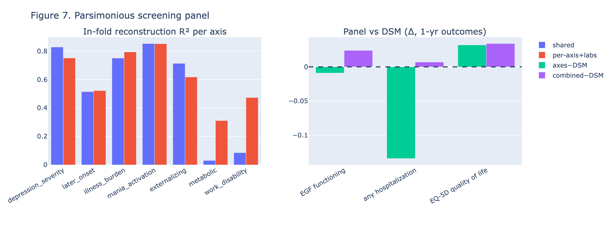

**Figure 7. Parsimonious screening panel (§4.5, §2.13).** *Left:* leakage-safe in-fold
reconstruction R² per axis for the **shared** 11-feature panel and the **per-axis** 13-feature panel
(+ routine labs) — the shared panel recovers the symptom/illness axes; the per-axis panel
additionally recovers work-disability; the metabolic axis needs the labs add-on. *Right:* the shared
panel vs DSM on 1-year outcomes (repeated-CV means) — it **outperforms** diagnosis on quality of
life (axes−DSM) and **complements** it on functioning (combined−DSM), while hospitalization stays
DSM-dominated. Generated by `scripts/22_screening_panel.py` (interactive: `results/reports/screening_panel.html`).

---

## Supplementary material

**Supplementary Figure S1. Discrete clustering does not yield temporally stable or
diagnosis-transcending subgroups (a negative result that motivates the dimensional model)**
(`results/reports/figures/figS1_dsm_phenotype_flow.png`, `figS1b_dsm_composition.png`;
`scripts/09_longitudinal_coherence.py` + `17_export_longitudinal_figure.py`). As an *exploratory
discrete view* — superseded by the dimensional model of the main text — we assigned every
patient–visit to one of five V0
domain-phenotypes with a NaN-native gradient-boosted classifier (shuffled 5-fold V0 accuracy 0.87)
and traced the flow **DSM-5 subtype → V0 → V1 → V2** (Sankey), with the DSM-5 composition of
each phenotype shown as a heatmap. Two features reinforce the dimensional conclusion rather
than contradict it: **(i) trans-diagnostic** — the five phenotypes are essentially
independent of the seven DSM-5 subtypes (adjusted Rand index **0.006**; every phenotype
draws from every diagnosis, Fig S1b); **(ii) fluid** — only ~**38%** of patients remain in
their V0 phenotype at each follow-up (V0↔V$k$ ARI ≈ 0.07), and persistence is itself
phenotype-dependent (trait-like smoking/illness-burden 0.59 vs state-like manic-activation
0.14). Discrete phenotypes are therefore neither diagnosis-aligned nor temporally stable —
consistent with reproducible *slices of a continuum* rather than natural kinds. The
continuous trait–state gradient on the seven dimensional axes (Figure 4, §3.6) is the stable
representation of this same longitudinal signal.

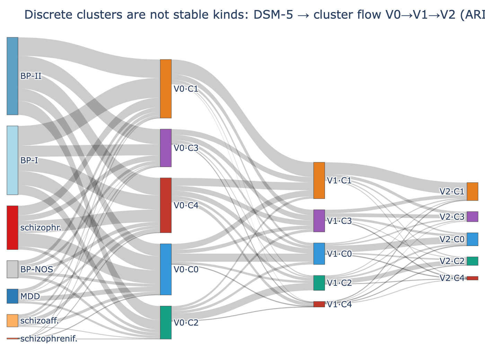

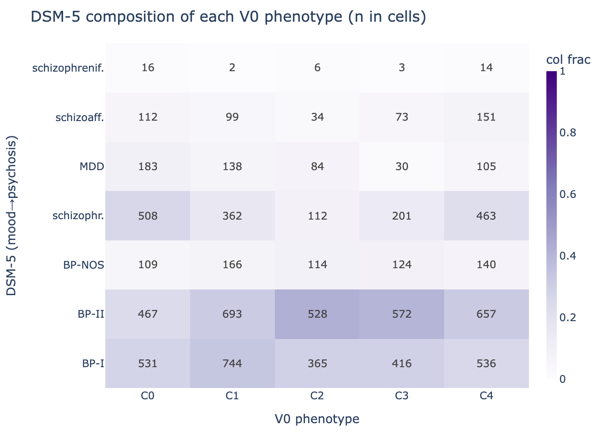

**Supplementary Figure S2. Factor-count selection (imputation-free)**
(`results/reports/figures/figS2_kcurve.png`; `scripts/15_review_checks.py`). Masked split-half Tucker
congruence vs K on the imputation-free model: the **minimum** congruence stays ≥0.85 from K=3
through K=7 (0.98, 0.97, 0.89, 0.89, 0.91 at K=3–7) and collapses at K=8 (0.22) — so the
reproducible range is K≤7. We lock **K=7** as the maximum reproducible dimensionality (a local
maximum, 0.91); K=4 and K=6 are defensible, more parsimonious alternatives. (Under the former
mean-fill estimation this curve was non-monotone/jagged — a sklearn-varimax instability that the
masked principal-axis estimator does not show.)

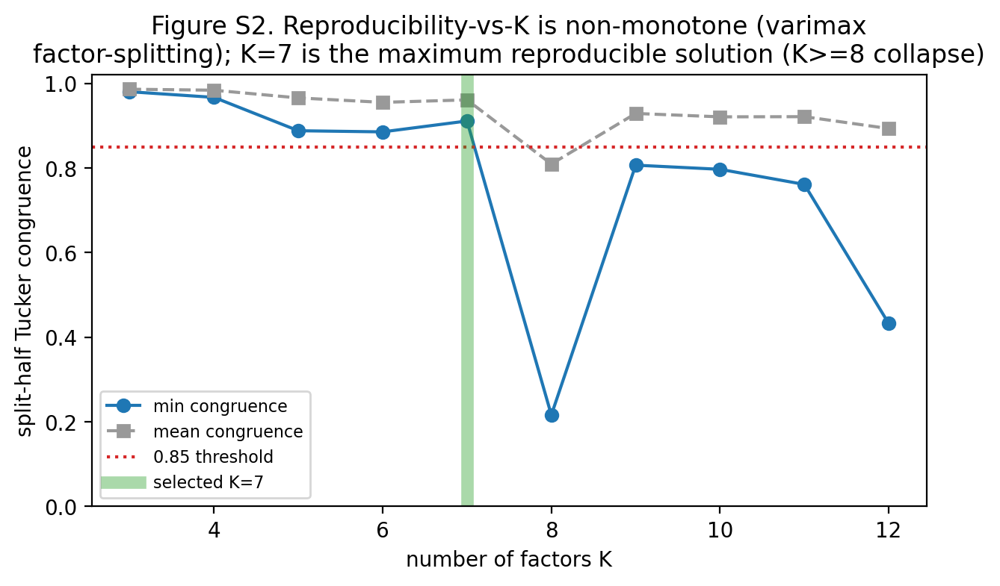

---

## Data and code availability

The FACE data are confidential and governed by the cohort's data-access procedures
(individual-level data are not shared). The full harmonization and analysis pipeline is
available as source: harmonization (`src/trans_diag`), structure test
(`scripts/04_structure_test.py`), dimensional model (`scripts/05_dimensional_axes.py`,
`06_dimensional_ae.py`, `07_dimensional_refine.py`), outcomes (`scripts/10_phase5_outcomes.py`),
longitudinal stability (`scripts/08_longitudinal_axes.py`), site robustness
(`scripts/13_robustness_site.py`), and cognition (`scripts/14_cognition_bpsz.py`). Reproducible
result artifacts are written to `results/` and interactive reports to `results/reports/`.

## Author contributions / Funding / Ethics

[TO CONFIRM — contributions per ICMJE; funding sources; ethics approval and consent
statements for the FACE cohort.]
