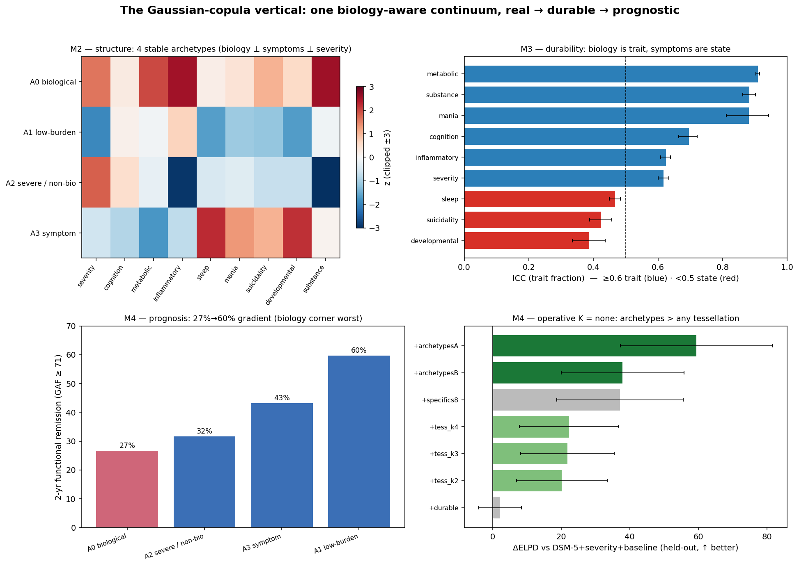

# The Gaussian-copula vertical — consolidated findings (M2 · M3 · M4 · M5)

> **Paper-facing synthesis of the reworked vertical.** On the certified cohort-weighted full-N
> **Gaussian-copula** measurement map (M1), the M2 stratification, M3 temporal coherence, M4 prognosis, and M5
> treatment moderation were each rebuilt as **parallel OOP engines that wrap the proven kernels** and leave the
> native pipelines (`scripts/20-57`) untouched. This is the one-page read of what the vertical found and what it
> means.
> Per-milestone canonical records: [`STRATA_OOP_FINDINGS.md`](STRATA_OOP_FINDINGS.md) ·
> [`STRATA_OOP_ATLAS.md`](STRATA_OOP_ATLAS.md) · [`TEMPORAL_OOP_FINDINGS.md`](TEMPORAL_OOP_FINDINGS.md) ·
> [`PROGNOSIS_OOP_FINDINGS.md`](PROGNOSIS_OOP_FINDINGS.md). One-figure summary:
> `docs/figures/copula_vertical/synthesis.png`. Pending PI sign-off. Updated 2026-06-22.

## The integrated headline

One object holds the three milestones together: **a biology-aware, continuous, transdiagnostic map that is
real (M2), durable (M3), and prognostic for functioning (M4)** — with the **biological corner** the most
distinct (M2), the most durable (M3), and the worst-prognosis (M4) of the four extremes. It is not biotypes
and not a clean clinical
category; it is a continuum with a stable set of extremes. Its demonstrated value is **group-level
stratification + continuous functional forecasting**, co-informative with DSM-5 — not an individual yes/no
calculator. The reworks **reproduce the native-map conclusions**, which is itself a robustness result (the
findings do not depend on the Gaussian-vs-copula likelihood).

## M2 — the structure: a continuum with stable extremes (no privileged K)

- **Continuum, not biotypes**, established by a single-Gaussian falsification null: the best partition of the
  cloud separates patients no better than a structureless Gaussian (silhouette **0.140 real vs 0.140 ± 0.003
  null, z = 0.1**; GMM-optimal K = 1 in all 20 posterior draws).
- The tessellation is therefore a **nested K-family (2/3/4), no privileged K** (XD-BIC flat 197.9k–199.5k).
  The load-bearing object is the **A = 4 stable archetype simplex** (only A = 2 and A = 4 reproduce
  cross-seed; native A = 8 does not).
- The four corners carry the payload — **biology ⊥ symptoms ⊥ severity**: A0 biological (inflammatory/
  metabolic/substance), A1 low-burden, A2 severe-but-non-biological, A3 symptom (sleep/developmental/
  suicidality/mania). All views transdiagnostic (ARI ≈ 0 vs cohort and DSM-5). *(Figure panel A.)*

## M3 — the durability: biology is trait, symptoms are state

- **G1 measurement holds**: all 5 backbone axes temporally invariant (φ 0.974–0.996); **inflammatory is now
  invariant** (0.974) vs *partial* on the native map.
- **G3 trait/state (ICC)**: metabolic **0.91**, substance 0.88, cognition 0.70, inflammatory 0.62 (trait);
  sleep 0.47, suicidality 0.42, developmental 0.39 (state). Severity is **trait by rank (0.62) while the
  population improves** (pop_slide −0.46). *(Figure panel B.)*
- **G4** archetype identity persists (weight-cosine median 0.90; 58% stable trajectories); G3⟷G4 ρ = −0.27.
- Clinical logic: **stratify on the durable biology, monitor the moving symptoms.**

## M4 — the predictive value: the durable biology forecasts functioning

- **Operative K = none.** Incremental held-out ΔELPD over DSM-5 + severity + baseline (functioning, N = 2,114):
  **archetypes +59**, ⊥G archetypes +38, 8-specifics +37, tessellation K=2/3/4 ≈ +20 (all predictive),
  durable-trio-alone +2 (ambiguous). The continuous/archetype representation **dominates any hard tessellation**.
  *(Figure panel D.)*
- **Functioning, not severity** (cgi_s autoregression-saturated). **Co-informative with DSM-5**
  (egf +both +67 > +dsm5 +29 > +map +22 — complements, not replaces).
- **Prognostic atlas: 2-yr functional remission 27% → 60%** across archetypes, biology corner worst (27%).
  *(Figure panel C.)*
- **Robust**: archetype signal survives IPW (+59), dropping DR or SZ (+56/+59); permutation null vanishes;
  weakens dropping BP — **course-dependent** (BP/DR-driven).

## The chain — the load-bearing achievement

The milestones are one argument about one phenotype:

> **M2: the biological corner is a real, distinct extreme → M3: that corner is durable (trait, ICC 0.91) →
> M4: that durable corner predicts 2-year functioning (worst remission, 27%).**

*Persists → predicts*, demonstrated end-to-end for a biology-aware phenotype, on a continuum, transdiagnostically,
with uncertainty propagated and no imputation at any step. A stratification that only recovered severity tiers
would be a re-dressed CGI-S; this one separates patients who look equally ill but are biologically opposite,
and that separation is durable and prognostically meaningful.

## M5 — treatment: the earned boundary holds (full record: [TREATMENT_OOP_FINDINGS.md](TREATMENT_OOP_FINDINGS.md))

Does the map *moderate* treatment response? On observational treatment-as-usual, **no — reliably not**, the
honest boundary reproduced on the copula object: lithium-BP a **well-identified null** (overlap 0.997, E-value
1.06); antipsychotic-BP **suggestive-but-unconfirmed** (ATE −0.23 excludes 0, **E-value 1.77 ≈ native's 1.79**,
moderation ΔELPD weak); clozapine-SZ non-decisive. But two positive reads: the **archetype carrier survives
treatment adjustment** (low-burden archetype, 4.7% attenuation — the functional forecast is not a treatment
proxy; *M5 strengthens M4*), and the **archetypes predict response heterogeneity** (resistance ΔELPD +20, CGI
response +16, side-effects +10, all archetype-driven). So the map *describes* who responds/resists, even though
it does not *causally select* a drug — true selection needs randomized data (M5b). Figure:
`docs/figures/treatment_oop/moderation.png`.

## Honest tensions (the calibration)

1. **The biology carrier shifted between map versions.** On the native map the *isolated durable trio*
   (metabolic/inflammatory EIV) survived M4; on the copula map **it does not** — the predictive signal lives in
   the **fuller archetype representation** (biology as a corner), not the standalone 3-axis block. "Biology
   predicts functioning" is now a *phenotype-level*, not an *isolated-axis*, claim.
2. **Group-level, not individual.** ΔELPD +59 collapses to **ΔAUC +0.011** for binary remission — continuous
   forecasting value, not a per-patient risk calculator.
3. **Course-dependent.** Value is BP/DR-driven; weak where the future is baseline-determined (SZ).
4. **"No privileged K" is honest but operationally awkward** — the actionable object is a continuous position /
   archetype blend, not a deployable category.
5. **G4 reliable-change is measurement-precision-confounded** (precisely-measured metabolic "moves" by that raw
   metric despite being trait); the error-corrected **G3 ICC is the clean signal**.
6. **Internal validity only**: no external cohort, no causal claim, scale-trajectory surrogates not events,
   2-year horizon; mania is data-limited (uninformative ICC).

## Calibrated claim & what's left

**Scientific validity: yes** — a real, stable, continuum (not biotype) map; biology⊥symptoms⊥severity; durable
biology; a genuine group-level incremental prognostic signal for functioning, co-informative with DSM-5, robust
to attrition/cohort/permutation. **Strong clinical utility: not demonstrated** — small individual-level gain;
treatment moderation does not hold on observational TAU (M5: lithium-BP a well-identified null, antipsychotic-BP
suggestive-unconfirmed E 1.77); internal validity only. Reporting the modest/null pieces plainly is a deliberate
correction to biotype/biomarker overclaiming.

**Remaining:** the full copula vertical (M1→M2→M3→M4→M5) is now reworked. What this baseline cohort cannot
supply: **M5b** (true treatment *selection* — randomized/trial-arm data) and external/causal validation.

## Engineering provenance

Parallel OOP engines, each wrapping the proven kernels with **no edits to the native pipelines**, on branch
`oop-strata-soft-regions`: `src/face/strata/strata_model_oop.py` (M2), `src/face/prognosis/prognosis_model_oop.py`
(M4), `src/face/temporal/temporal_model_oop.py` (M3), `src/face/treatment/treatment_model_oop.py` (M5). Built on
the certified copula M1
(`src/face/models/bayesian/measurement_model_oop.py`, `likelihood_mode="gaussian_copula"`). Validated end-to-end
(M3 V0 reproduces the M2 coords at r ≈ 0.99); uncertainty propagated; no imputation; adversarial structure-testing
(the single-Gaussian null). Outputs under `results/face/{strata_oop,prognosis_oop,temporal_oop}/`; 45 tests across
`tests/{strata,prognosis,temporal}/`.
