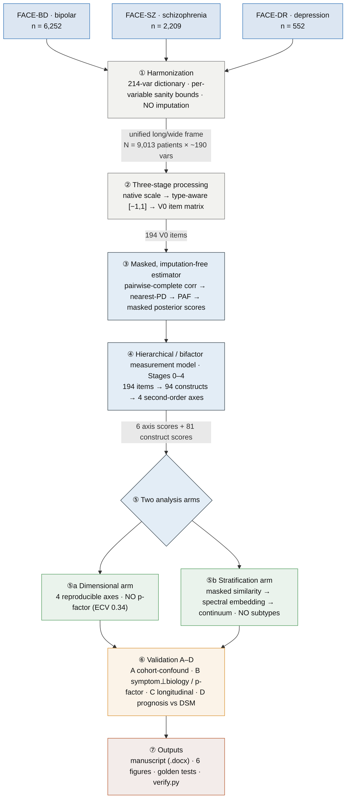
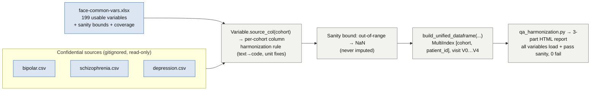
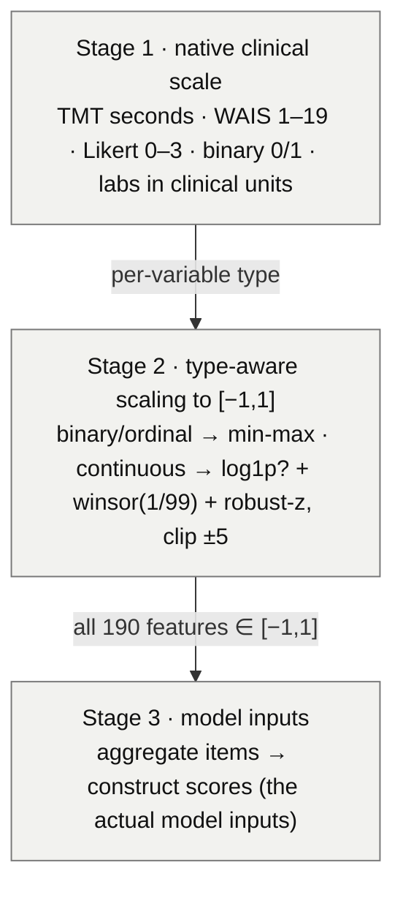
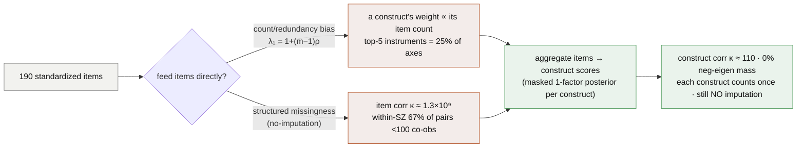
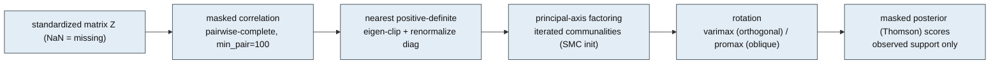
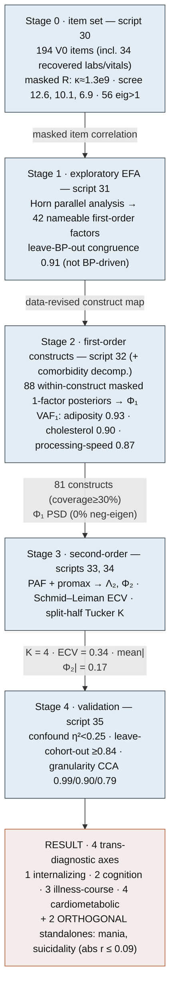
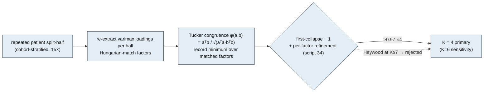
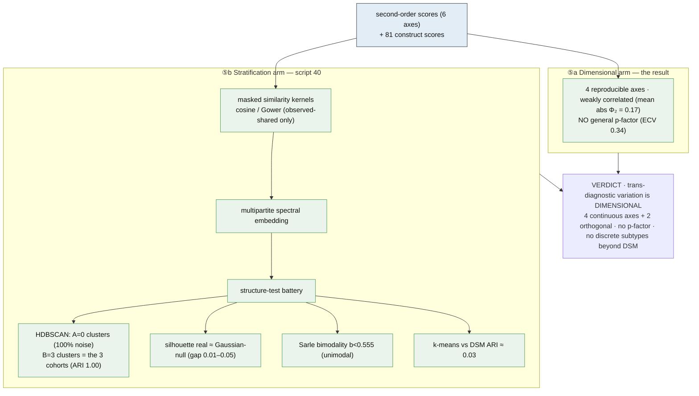
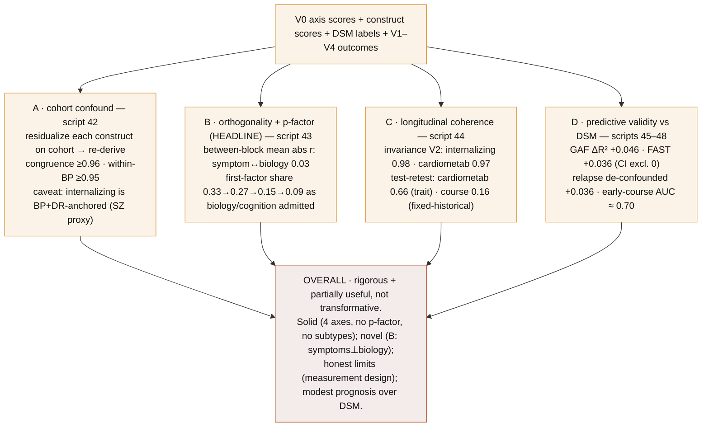
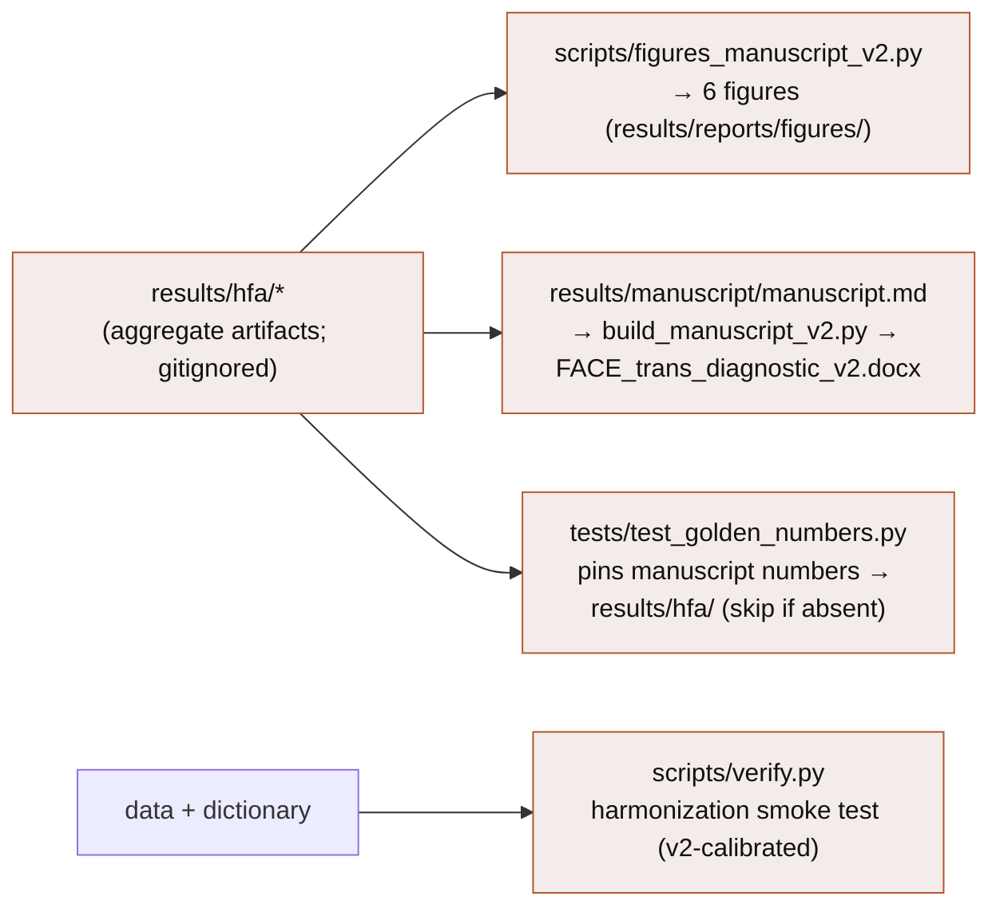

# PIPELINE — FACE trans-diagnostic study (v2)

> A complete, scientifically rigorous map of the analysis, from the three confidential cohort CSVs to
> the manuscript. Every stage lists its **inputs → operation → outputs**, the **mathematics**, the
> **parameters**, the **script** that runs it (`scripts/*_v2.py`), and the **artifact** it writes
> (`results/hfa/`). Companion docs: [ROADMAP](ROADMAP.md) · [AGGREGATION_RATIONALE](AGGREGATION_RATIONALE.md)
> · [HIERARCHICAL_FA_PLAN](planning/HIERARCHICAL_FA_PLAN.md) · [VALIDATION_PLAN_v2](planning/VALIDATION_PLAN_v2.md) ·
> [FINDINGS](FINDINGS.md) · [LABBOOK](LABBOOK.md). Manuscript: `results/manuscript/`.

## Design invariants (hold everywhere below)

| Invariant | Statement |
|---|---|
| **V0 anchor** | Structure is *defined* at baseline (V0); later visits (V1–V4) only *test* its temporal coherence, never define it. |
| **No imputation** | No cell is ever filled. Missingness is handled by *masked* (pairwise-complete) covariance and observed-support factor scores. |
| **Masked estimator** | One imputation-free engine (`src/trans_diag/masked_fa.py`) underlies every factor model: masked correlation → nearest-PD → PAF → masked posterior scores. |
| **Estimate, don't assert** | The measurement model is *hybrid* (clinical anchors, data-revised); dimensionality `K` is locked by **reproducibility**, and a general factor is **tested** (Schmid–Leiman ECV), not assumed. |
| **Aggregate before geometry** | Items are aggregated to construct scores before any inner-product/MSE method, to remove item-count bias and ill-conditioning (§3). |

**Legend for the diagrams** — `▭` process · `⬢`/`{ }` decision · solid arrow = data flow (edge label = data shape) · dashed arrow = control/decision · color: blue = data, grey = processing, steel = model, green = analysis arm, amber = validation, red = output.

---

## 0 · Master pipeline

### Data-dimension tracker (how shape flows)

| Stage | Script | Rows | Features | Gate / parameter |
|---|---|---:|---:|---|
| Raw cohort CSVs | — | 9,013 (V0) | per-cohort columns | confidential, read-only |
| Harmonized (long) | `loader` | 9,013 × visits | ~195 vars | `readiness ∈ {READY, PARTIAL}` (199 usable) |
| V0 item matrix | `30` | 9,013 | **194 items** | drop ids / age·sex (resid.) / confounds / branching-suicide |
| Stage 1 EFA | `31` | 9,013 | **42 factors** | Horn parallel analysis |
| Stage 2 constructs | `32`, `sens_comorbidity` | 9,013 | **94 constructs** | masked 1-factor, `min_pair = 100` |
| Stage 3 input (Φ₁) | `33` | 9,013 | **81 constructs** | coverage ≥ 0.30, standardized |
| Stage 3 axes | `33`, `34` | 9,013 | **4 axes (+ general)** | `K` by split-half Tucker ≥ 0.85 |
| Stratification | `40` | 9,013 | 6 axes / 81 constructs | HDBSCAN, silhouette-vs-null |
| Validation D | `45`–`48` | ≤ 3,378 / 1,766 intervals | axes vs DSM | GroupKFold by patient |

---

## 1 · Sources & harmonization

- **Harmonization registry** (`rules.py`): `@register` transforms (e.g. haematocrit L/L → %, MCHC g/L → g/dL) — 25 registered, 165 identity-cast.
- **Identifiers** (`usubjid_patients`, `cohort`, `arm`, `visit`, `siteid_city`) are loadable for stratification but **excluded from all feature sets** (`ADMINISTRATIVE_FEATURES`).
- **Attrition (informative):** V0 9,013 → V1 4,270 → V2 2,958 → V3 1,955 → V4 779. DR collapses by V3 ⇒ the longitudinal/predictive arm is effectively **BP + SZ**.

---

## 2 · Three-stage processing

**Scaling equations.** Binary/ordinal/Likert variables are min–max mapped, $x' = 2\frac{x-\min}{\max-\min}-1$. Continuous variables use a robust-$z$ (optional $\log(1+x)$ for heavy right-skew, winsorized at the 1st/99th percentile):

$$\tilde z_j \;=\; \frac{1}{5}\,\operatorname{clip}\!\left(\frac{x_j-\operatorname{median}(x_j)}{1.4826\,\operatorname{MAD}(x_j)},\,-5,\,+5\right)\in[-1,1].$$

> **Why scaling is necessary but not sufficient.** It equalizes per-*column* variance but cannot fix two problems that distort every inner-product / squared-error method — these motivate §3 (aggregation) and §4 (the masked estimator).

---

## 3 · Aggregation rationale (why constructs, not items)

Two problems survive standardization. Both are derived and quantified in [AGGREGATION_RATIONALE.md](AGGREGATION_RATIONALE.md).

**(i) Count/redundancy bias.** For $m$ items with mean inter-item correlation $\rho$, the shared variance piles into one leading eigenvalue $\lambda_1 = 1+(m-1)\rho$, so an $m$-item construct can dominate "the largest axis" while a clinically equal single-item construct cannot form a factor. It is **method-agnostic** (a linear autoencoder *is* PCA; a Gaussian VAE likelihood *is* weighted MSE).

**(ii) The no-imputation argument.** Mean-filling shrinks each correlation by co-observation, $\operatorname{corr}_{\text{fill}}(A,B)\approx O_{AB}\,\operatorname{corr}_{\text{masked}}(A,B)$ with $O_{AB}=n_{AB}/\sqrt{n_A n_B}$ — and because missingness is cohort-patterned, $O_{AB}$ is itself a cohort signal. Hence **masked** covariance, never imputation.

---

## 4 · The masked, imputation-free estimator (the mathematical core)

One engine (`masked_fa.py`) is reused at every level (within-construct, Φ₁, second-order, per-visit, split-half).

**Masked correlation → nearest-PD.** Each entry uses only co-observed patients; cells with $<100$ co-observations are set to 0. Then

$$\tilde R \;=\; \arg\min_{X\succeq 0,\;\operatorname{diag}(X)=1}\lVert R-X\rVert_F \quad(\text{eigenvalue clipping}).$$

**Principal-axis factoring.** Initialize communalities $h^2$ at the squared multiple correlations; iterate: place $h^2$ on the diagonal, take the top-$k$ eigenpairs $L=V_k\operatorname{diag}(\sqrt{\lambda_k})$, update $h^2\leftarrow\sum_k L^2$, repeat.

**Masked posterior factor scores** (no imputed value ever enters a score). With observed sub-vector $z_{i,o}$, sub-loadings $L_o$, uniquenesses $\Psi=I-\operatorname{diag}(LL^\top)$ (floored at 0.05):

$$\hat f_i \;=\; \bigl(I_k + L_o^\top\Psi_o^{-1}L_o\bigr)^{-1}L_o^\top\Psi_o^{-1}\,z_{i,o}.$$

---

## 5 · Hierarchical / bifactor measurement model (Stages 0–4)

The two-level model: items → first-order **construct factors** → second-order **trans-diagnostic dimensions**,

$$z=\Lambda_1 f_1+\varepsilon_1,\;\;\operatorname{Cov}(f_1)=\Phi_1;\qquad f_1=\Lambda_2 f_2+\varepsilon_2\;\Rightarrow\;\Phi_1=\Lambda_2\Phi_2\Lambda_2^\top+\Psi_2.$$

### Stage 2 — construct scores
Each construct's score is the **within-construct masked one-factor posterior** of its sign-oriented items (Eq. of §4 with $k=1$). Unidimensionality is summarized by the first-factor share

$$\mathrm{VAF}_1=\lambda_1\big/\textstyle\sum_j\lambda_j.$$

Splitting multidimensional clinical blocks concentrated signal the flat means had diluted (collapsed metabolic mean $\mathrm{VAF}_1=0.40$ → adiposity 0.93 / cholesterol 0.90 / BP 0.72 / lipids 0.72).

### Stage 3 — second-order dimensions & the general-factor test
Factor $\Phi_1$ (81 constructs) → oblique $\Lambda_2,\Phi_2$. A **general factor is tested** by Schmid–Leiman: with $\gamma$ the loadings of the $K$ dimensions on a single second-order factor,

$$g=\Lambda_2\gamma,\qquad S=\Lambda_2\odot\sqrt{1-\gamma^2},\qquad \mathrm{ECV}=\frac{\sum_j g_j^2}{\sum_j g_j^2+\sum_{j,k}S_{jk}^2}.$$

$\mathrm{ECV}=0.34<0.5\Rightarrow$ **no dominant p-factor**.

### `K`-selection (locked by reproducibility, not eigenvalues)

---

## 6 · Analysis arms

**Sarle bimodality coefficient** (per axis), with $g_1,g_2$ the sample skewness and excess kurtosis:

$$b=\frac{g_1^2+1}{\,g_2+\dfrac{3(n-1)^2}{(n-2)(n-3)}\,},\qquad b>0.555\Rightarrow\text{possible bimodality.}$$

---

## 7 · Validation A–D

**Math used in validation.**

- **Confound battery (A, D):** categorical $\eta^2=\mathrm{SS}_{\text{between}}/\mathrm{SS}_{\text{total}}$; continuous $R^2$. Flag any axis with $>0.25$.
- **Reproducibility (A, Stage 4):** Tucker congruence $\phi(a,b)=a^\top b/\sqrt{(a^\top a)(b^\top b)}$, Hungarian-matched; leave-cohort-out and cohort-residualized re-derivations.
- **Granularity invariance (Stage 4):** canonical correlations $\rho_c=\operatorname{svd}(Q_A^\top Q_B)$ between hierarchical and flat-domain axis scores (anti-circularity; top-3 = 0.99/0.90/0.79, null ≈ 0.04).
- **Predictive design (D):** nested predictor sets $M_0=\text{age+sex(+baseline)}$, $M_1=M_0+\text{DSM}$, $M_2=M_0+\text{dims}$, $M_3=M_0+\text{both}$, $M_{2x}$ cross-domain (drop internalizing = non-circular). Out-of-sample, cohort-stratified CV; $\Delta R^2/\Delta\mathrm{AUC}$ with bootstrap CIs.
- **De-confounded relapse (D):** remission-based **discrete-time survival** over person-intervals, $\operatorname{logit}\Pr(T_i=t\mid T_i\ge t,x_i)=\alpha_t+\beta^\top x_i$, **GroupKFold by patient** (no leakage), bootstrap CIs by patient. Removes the regression-to-the-mean confound (baseline AUC 0.765 → 0.578).

---

## 8 · Outputs, reproducibility & artifact map

### Script → artifact map

| Step | Script | Writes (`results/hfa/`) |
|---|---|---|
| Stage 0 item set | `30_hfa_stage0_itemset_v2.py` | `stage0_diagnostics_v2.json`, `stage0_items_v2.csv`, `stage0_corr_resid_v2.npz` |
| Stage 1 EFA | `31_hfa_stage1_efa_v2.py` | `stage1_loadings_v2.csv`, `stage1_construct_purity_v2.csv` |
| Stage 2 constructs | `32_hfa_stage2_v2.py` (+ `sensitivity_comorbidity_v2.py`) | `stage2_scores_v2.pkl`, `stage2_phi1_v2.csv`, `stage2_construct_fit_v2.csv` |
| Stage 3 second-order | `33_hfa_stage3_v2.py` | `stage3_loadings_v2.csv`, `stage3_phi2_v2.csv`, `stage3_scores_v2.pkl` |
| K-selection | `34_hfa_kselect_v2.py` | (console: per-factor congruence) |
| Stage 4 validation | `35_hfa_stage4_v2.py` | (console: confound / LCO / CCA) |
| Stratification | `40_phase5_stratify_v2.py` | `phase5_structure_v2.json` |
| Study A | `42_cohort_confound_v2.py` | `studyA_cohort_confound_v2.json` |
| Study B | `43_orthogonality_pfactor_v2.py` | `studyB_orthogonality_v2.json` |
| Study C | `44_longitudinal_coherence_v2.py` | `studyC_longitudinal_v2.json` |
| Study D (predictive) | `45_predictive_validity_v2.py` | `studyD_predictive_v2.json` |
| Study D (survival) | `46_predictive_survival_v2.py` | `studyD2_survival_v2.json` |
| Study D (relapse >0.7) | `47_…richbaseline`, `48_…trajectory` | `studyD3_richbaseline_v2.json`, `studyD4_trajectory_v2.json` |
| Sensitivity | `sensitivity_aggregation_v2.py`, `…_polychoric_v2.py` | (console / reports) |

### Parameters & decision rules

| Symbol | Value | Meaning | Set in |
|---|---|---|---|
| `min_pair` | 100 | min co-observations per masked-correlation cell | `masked_fa.py` |
| `ψ` floor | 0.05 | uniqueness floor (Heywood guard) in scores | `masked_fa.py` |
| clip | ±5 | robust-$z$ clip (then ÷5 → [−1,1]) | `domains.py` |
| coverage floor | 0.30 | min construct coverage to enter Stage 3 | `33_…` |
| `K_floor` | 0.85 | split-half Tucker congruence threshold | `33_…` |
| **K** | **4** | number of second-order trans-diagnostic axes | `33`, `34` |
| **ECV** | **0.34** | general-factor common variance (< 0.5 ⇒ no p-factor) | `33` |
| confound flag | 0.25 | axis flagged if any $\eta^2/R^2$ exceeds it | `35` |

---

### One-line summary of the whole pipeline

> Harmonize three psychoses (N = 9,013) into a 214-variable dictionary → scale by type to [−1,1] →
> under strict **no-imputation**, estimate a **masked** hierarchical/bifactor measurement model
> (194 items → 94 constructs → **4 second-order axes**, general factor **tested** and rejected at
> ECV 0.34) → confirm the structure is **dimensional** (no subtypes) → validate that it is not a
> cohort artifact, that **symptoms are orthogonal to biology** (the p-factor is symptom-only),
> that it is longitudinally coherent, and that it adds a **modest, honest** prognostic increment
> over DSM.
