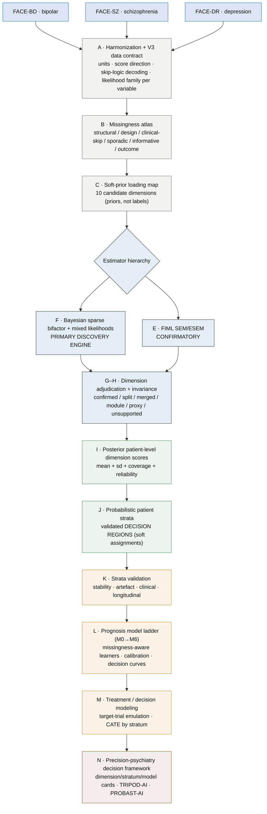

# PIPELINE — FACE V3 target architecture

> The end-to-end map of the **V3** precision-psychiatry pipeline: from the three confidential cohort
> CSVs to validated dimensions, probabilistic strata, and decision models. Plan of record:
> [`V3_PLAN.md`](V3_PLAN.md) · what/why: [`ROADMAP.md`](ROADMAP.md) · data contract: [`DATA.md`](DATA.md).
>
> The discovery engine (FIML confirmatory + Bayesian mixed-likelihood latent model + decision modeling,
> Phases E–M) is **not yet built** — this document is its target design.

## Design invariants (hold everywhere)

| Invariant | Statement |
|---|---|
| **No naive imputation** | No completed-data / mean / KNN / MICE matrix, ever. Structure is estimated from **observed cells** via observed-data likelihood (FIML / Bayesian), with posterior uncertainty. Deterministic skip-logic structural-zero decoding is kept (it is *not* imputation). |
| **V0 anchor** | Dimensions are *defined* at baseline (V0); later visits (V1–V4) only *test* temporal coherence and supply outcomes. |
| **Diagnosis = covariate / validation** | BP/SZ/DR labels are entry + validation metadata and measurement-model covariates — **never** dimension indicators or clustering features. |
| **Soft ontology** | The 10 candidate dimensions are **soft priors**, not fixed scores; the data may confirm / split / merge / reject / downgrade / cross-load them. |
| **Observation likelihood carries type** | Variables keep their distributional meaning (Gaussian, Student-t, lognormal, ordered-logit, Bernoulli, neg-binomial). The model does **not** force everything onto one shared metric — each variable's type drives its likelihood. |
| **Utility, not elegance** | Every accepted dimension/stratum must demonstrate downstream decision value. |

## 0 · Master pipeline (V3)

## 1 · Missing-data doctrine (the principle that defines V3)

This is the single most important invariant to preserve. V3 estimates all structure from an
**observed-data likelihood** that keeps each patient's missing cells **missing** — no cell is ever
filled.

| | Forbidden | Allowed |
|---|---|---|
| **Before discovery** | completed-data imputation; a mean/KNN/MICE-filled matrix for FA or clustering; deep models requiring complete input vectors | observed-data **FIML**; **Bayesian** observed-likelihood `p(X_observed \| latent, params)` |
| **Skip-logic** | inventing values where the gate is unknown; overwriting observed values | deterministic **structural-zero** decoding for gated items (e.g. `attempt_count = 0` when `attempt_ever = 0`) |
| **Uncertainty** | point scores that hide measurement coverage | **posterior** dimension scores with `sd`; per-patient observed-indicator counts; reliability proxies |
| **Informative missingness** | assuming MAR silently | start MAR, then **model `R_ij`** explicitly as a sensitivity check (selection/shared-latent models) |

**Why FIML/Bayesian ≠ imputation.** A filled matrix invents cell values and then treats them as data;
an observed-data likelihood **never materializes the missing cells** — it integrates each patient's
contribution over only the variables they actually have, so missingness changes the *information* a
patient contributes, not their *values*. Because FACE missingness is cohort- and site-patterned, any
fill re-imports exactly the confounds we are trying to avoid.

## 2 · The primary discovery engine (Phase F)

Patient-level latent variables, observation model, and soft priors:

$$G_i \sim \mathcal N(0,1),\qquad D_{ik}\sim \mathcal N(0,1),$$
$$\eta_{ij} \;=\; \alpha_j \;+\; \lambda_{jG}\,G_i \;+\; \sum_k \lambda_{jk}\,D_{ik} \;+\; \beta_j^\top c_i,\qquad X_{ij}\sim \text{likelihood}_j(\eta_{ij},\,\theta_j),$$

with covariates $c_i$ = {cohort, site, age, sex, education} entering the **measurement** model (not as
dimensions), and a general burden factor $G$ estimated **directly** (orthogonal to the specifics $D$ in
the first pass; correlated $D$ in a sensitivity model — this tests for a general psychopathology factor
under patient-level likelihood).

**Mixed likelihoods by variable type** (the observation likelihood carries the type — see
[`DATA.md`](DATA.md) for the per-variable map):

| Variable type | Likelihood |
|---|---|
| standardized continuous clinical score | Gaussian / Student-t |
| skewed biological marker | lognormal / Student-t after `log` |
| ordinal questionnaire item | ordered logistic / ordered probit |
| binary clinical / suicide item | Bernoulli-logit |
| count variable | negative binomial / Poisson |
| zero-heavy count | zero-inflated NB (if justified) |
| longitudinal outcome | **separate** outcome model — never the baseline dimension model |

**Soft loading priors** encode the 10-candidate ontology as hypotheses, not labels:

$$\lambda_{jk}\sim\mathcal N(0.6,\,0.3)\ \text{(primary)},\quad \mathcal N(0,\,0.25)\ \text{(plausible cross-load)},\quad \mathcal N(0,\,0.05)\ \text{(unlikely)},$$

or a horseshoe / spike-and-slab shrinkage prior for stronger discovery. The data can retain unexpected
cross-loadings or shrink unsupported loadings to zero. **Mandatory diagnostics:** R-hat, effective
sample size, divergences, prior/posterior predictive checks, loading stability, posterior uncertainty
by cohort.

## 3 · Confirmatory arm

- **FIML confirmatory (Phase E).** Patient-level FIML SEM/ESEM on approximately-continuous variables /
  construct scores: 1-factor, candidate 6–8 dim, bifactor, ESEM cross-loading. *Complete-data ML is
  precluded by missingness; observed-data FIML is not, and is compatible with no naive imputation.*

## 4 · Dimensions → strata → decisions

- **Adjudication (G).** Each candidate → {confirmed · split · merged · module · proxy · unsupported} by
  approximate-LOO / predictive log-likelihood, posterior predictive checks, reliability, invariance,
  resampling stability, and outcome validity.
- **Strata (J).** Probabilistic decision regions on posterior dimension scores (LPA / Bayesian GMM /
  mixture-of-factors / risk-threshold regions); keep `P(stratum=k)` + entropy. A stratum may be valid on
  a continuous distribution if it is stable, interpretable, non-artefactual, prognostic, and useful. A
  direct-similarity stratification on the observed cells serves as a *secondary* control.
- **Validation (K) + prognosis (L) + treatment (M).** Strata must predict **future** outcomes not used
  to define them; the model ladder `M0(age+sex+site) → +DSM → +severity → +dimensions → +strata →
  +raw/missingness → +early-course` quantifies incremental value with calibration + decision-curve net
  benefit; treatment questions go through **target-trial emulation** with CATE by stratum.

## 5 · Outputs

V3 deliverables (Phase Q): V3 data dictionary + missingness atlas · FIML confirmatory ·
Bayesian sparse-bifactor model · dimension adjudication · **probabilistic phenotype atlas** ·
probabilistic strata · strata validation · prognosis model-ladder · treatment target-trial
feasibility — each with model/dimension/stratum cards and TRIPOD-AI / PROBAST-AI reporting.

---

### One-line summary

> Harmonize three psychoses under a V3 data contract → atlas the missingness → seed a **soft-prior**
> map from the 10 candidate dimensions → estimate a **patient-level, observed-likelihood**
> latent model (Bayesian mixed-likelihood primary; FIML confirmatory) with posterior uncertainty and an
> explicit general factor → **adjudicate** dimensions → score patients → derive **probabilistic
> decision strata** → validate them longitudinally → quantify incremental **prognosis** and, under
> target-trial discipline, **treatment** decision value beyond DSM + severity.
