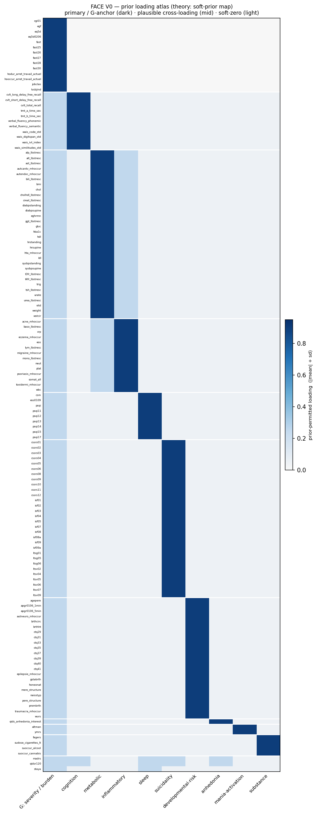

# Prior loading atlas — the theory (soft-prior map)

> **Map of record (read first).** This atlas is the **prior (theory) ontology** — the candidate factors *before*
> the data adjudicate them, not the fitted map. The fitted map of record is the **8-factor immunometabolic map**:
> G (overall burden) + 7 specific axes — cognition, **immunometabolic** (the cardiometabolic and inflammatory
> candidate pools below resolve into one biology factor), sleep, mania/activation, suicidality,
> developmental-risk, and **substance** (orthogonal); the anhedonia candidate is rejected (absorbed by G). The
> strata reading lens is **A = 5 archetypes**. Canonical map findings: [`HORSESHOE_ESEM.md`](HORSESHOE_ESEM.md).

> The **prior** half of the dimensional map: where each FACE common-variable instrument is *expected* to
> load on the candidate dimensions, before any model is fit. It is generated purely from `configs/`
> (no patient data) and is the "before" of the **prior → posterior comparison** that demonstrates the
> hybrid model adjusting theory with data (methods: [`MEASUREMENT_MODEL.md`](MEASUREMENT_MODEL.md) §2.3).
> Reproduce: `python3 scripts/v3/05_prior_atlas.py`.



## How to read it

Rows = the **143 modeled indicators**, grouped by their home factor; columns = the **10 candidate
factors** (general factor `G` + 9 specifics). Cell shade = **prior-permitted loading** (`|mean| + sd`,
config-derived):

- **dark** = `primary` / `G-anchor` — theory *expects* a substantial loading (home cell);
- **mid** = `plausible_cross` — theory *allows* a loading; the data may keep or shrink it;
- **light** = soft-zero (`unlikely` / bifactor `G_anchor_on_specific`) — suppressed unless the data
  surprise the prior.

What the figure shows about the encoded design:

- **Block-diagonal primaries** — each factor is anchored by its own indicator pool.
- **The `G` column** is dark for the functioning/severity anchors *only*, and faint-blue for every
  specific item (each *may* load on `G`) — the **bifactor** mechanism by which `G` becomes "general"
  only if the data put many specifics on it.
- **Cross-loading windows** (`madrs`, `qidsr120`, `staya`, bottom rows) have **no dark home** — only
  mid-tone cells across {`G`, anhedonia, sleep, suicidality, cognition}: composite symptom scores that
  inform several axes, not a dimension of their own.
- **Metabolic ↔ inflammatory** carry a mutual mid-tone cross — the hypothesised split that the data
  will adjudicate.

## Per-factor prior pool

| Factor | Primary indicators | Likelihood mix | Note |
|---|---:|---|---|
| **G** — severity / burden | 14 | gaussian 11 · bernoulli 3 | functioning + global severity **only**; held orthogonal (bifactor) |
| cognition | 11 | gaussian 11 | full neuropsychology (CVLT/WAIS/fluency/TMT) |
| metabolic | 32 | gaussian 19 · lognormal 10 · bernoulli 3 | cardiometabolic + thyroid/liver/renal/HR + comorbidity flags |
| inflammatory | 14 | lognormal 8 · bernoulli 6 | innate-immune load + inflammatory/allergic comorbidity |
| sleep | 9 | gaussian 9 | objective + subjective PSQI + ESS/CSM |
| suicidality | 30 | bernoulli 14 · ordered-logistic 14 · gaussian 1 · neg-binomial 1 | ISF + C-SSRS + attempt-lethality (**mixed likelihoods**) |
| developmental-risk | 23 | gaussian 12 · bernoulli 8 · ordered-logistic 3 | WURS + CTQ + neuro/family history + perinatal (proxy) |
| anhedonia | 1 | gaussian 1 | **thin** — 1 direct item; likely merges into `G` or is rejected |
| mania-activation | 2 | gaussian 2 | candidate factor (YMRS / Altman); confirm or reject |
| substance | 4 | bernoulli 2 · gaussian 1 · neg-binomial 1 | candidate factor; confirm or reject |
| *cross-loading windows* | — | gaussian (3) | `madrs`/`qidsr120`/`staya` → plausible on {`G`, anhedonia, sleep, suicidality, cognition} |

**143 indicators × 10 factors.** Recorded as `unsupported` (no usable common indicators, so absent from
the figure): **negative symptoms** (no PANSS/SANS), **sensory abnormalities** (no battery),
**impulsivity** (no direct scale — informed indirectly via mania/substance cross-loadings).

## What this is *not* yet

This is **theory** — the prior. It does not show what the data say. After the global model is fit
(`MEASUREMENT_MODEL.md` §4, stages S1→S5), the **empirical atlas** (posterior loadings `Λ` + factor
correlations `Φ`, with uncertainty) is produced and placed beside this one; the per-candidate verdict
(`confirmed | split | merged | proxy | rejected | not_testable`, §6) is read from that comparison. That
prior → posterior figure is the scientific deliverable — it shows the 10 theoretical candidates being
**confirmed, reshaped, or dropped by the FACE cohort data**.

## Reproduce

```bash
python3 scripts/v3/05_prior_atlas.py
# -> docs/figures/prior_atlas.png  +  docs/figures/prior_atlas_by_factor.csv
```
