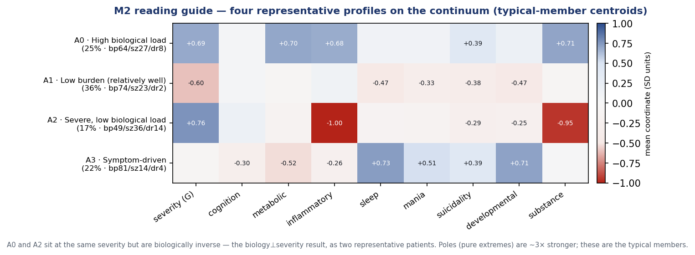

# M2 reading guide — how to read the transdiagnostic map

> **What M2 is (reframed).** M2 tested whether the FACE map contains patient *types* (biotypes) and found it
> does **not** — the 8-dim copula space is a **continuum** (single-Gaussian falsification null). So the
> load-bearing object of M2 is **not a typology**; it is the **continuous coordinate system** itself — each
> patient's validated, transdiagnostic position on eight axes, with uncertainty — plus this **reading guide** and a
> **patient-similarity** tool for interpreting positions. The five "archetype" corners and the K-region
> tessellation are **interpretation lenses** on that continuum, not discovered subgroups. (M4 confirms this
> empirically: *operative K = none* — no hard partition adds predictive value beyond the continuous coordinates.)

## How to read a patient
A patient is a **point** on the map. Three complementary lenses describe where they are:
1. **Coordinates** (the truth) — their score on each of the eight axes, with error bars. This is what M3/M4/M5 use.
2. **The five corners** (§ reading guide) — the poles of the cloud; a patient is a *blend* of them ("pulled toward
   the biological corner"). The corners carry the biology⊥symptoms⊥severity structure.
3. **Nearest neighbours** (§ similarity tool) — the real patients most similar to this one.

A **corner** is a *pure extreme* almost nobody sits exactly at; its **typical representative** is the centroid of
patients who lean toward it (what a representative patient actually looks like); its **medoid** is a real exemplar
patient. Reporting the triplet keeps both the defining signal (pole) and the realism (typical member + real person).

## The five representative profiles (Arm A, all eight axes)



| corner | plain clinical label | share | enrichment | defining signal |
|---|---|---|---|---|
| **A0** | **Activation / sleep-disturbed** | 16% | BP-led | disrupted sleep/circadian + mood activation (mania), below-average overall severity |
| **A1** | **Severe, clean biology** | 18% | mixed | high overall clinical severity *without* the immunometabolic signature, low developmental risk |
| **A2** | **High biological load** | 16% | DR-enriched | elevated immunometabolic (cardiometabolic + inflammatory) markers, with high severity, suicidality and developmental risk — the **biology corner** |
| **A3** | **Trauma / suicidality** | 22% | mixed | high early-life adversity (developmental) and suicidality, near-average severity, low immunometabolic |
| **A4** | **Low burden (relatively well)** | 28% | BP/SZ-led | mild across symptoms and biology — the "well" reference pole |

`results/face/strata_oop/reading_guide/reading_guide.csv` carries the full pole + typical-member vectors and the
medoid patient id per corner. The exemplars are **cohort-diverse** (the biology corner's medoid is a schizophrenia
patient; others bipolar) — the corners are **transdiagnostic**, not relabelled diagnoses.

## The headline, made pointable
**A2 and A1 sit at high overall severity (+2.36 vs +1.88) but are biologically inverse**: A2's typical member is
high on the immunometabolic axis (pole +3.46), A1's is *low* on it (pole −1.93). Two "typical patients," equally
ill, biologically opposite. That single contrast **is** the project's biology⊥severity result, rendered as two
representative profiles a clinician can hold — and, crucially, **the immunometabolic axis stays the *defining*
axis of A2's representative** (its top axis), diluting the pure pole only ~3× toward the typical member. A hard
tessellation, by contrast, splits the cloud on *symptom burden* (mania + suicidality) and shrinks biology to a
faint co-loading (immunometabolic η² 0.027 at K = 2) — which is exactly why the reading guide is anchored to the
archetype corners, not to region centroids.

## The patient-similarity tool (the continuum-honest core)
For any patient: their axis profile + their **nearest real neighbours**, computed with an uncertainty-aware
distance over diagonal posteriors,

    d²(i,j) = Σ_d (μ_i,d − μ_j,d)² / (σ_i,d² + σ_j,d² + ε)

so an axis a patient is uncertain about contributes little (an ill-measured patient gets a *fuzzy* neighbourhood).
Two spaces are exported: **Arm A** = all eight axes ("similar overall, incl. severity"); **Arm B** = the seven
specifics with severity removed ("similar in clinical *kind*, regardless of how ill"). Hand-off:
`results/face/strata_oop/similarity/neighbors.parquet` (9,013 patients × top-10, both arms; neighbours keyed as
`cohort/patient_id`).

Two things the demonstration on the five medoid exemplars shows: (a) neighbours are **transdiagnostic** (e.g. the
biological-pole patient's nearest neighbours mix BP/SZ/DR), and (b) the **Arm-B "in-kind" space recovers the
phenotype** where Arm-A mixes in severity — clearest for the trauma/suicidality exemplar (A3) (4/5 in-kind
neighbours share that symptom phenotype vs a mixed overall set). This is the transdiagnostic promise made
concrete: "your most similar patients, across diagnoses, look like this."

## Honest framing (do not over-read)
- These are **reading lenses on a continuum**, not natural kinds. Most patients are genuine blends (high corner
  entropy). "A2 vs A1" is a way to *talk about positions*, not a claim that patients fall into five boxes.
- The **pole** is the pure extreme (rare); the **typical member** centroid is ~3× milder; report the triplet.
- The **tessellation** (K=2/3/4) is an **optional** convenience for workflows that need hard boxes; its borders are
  arbitrary (no privileged K) and it is *not* the load-bearing object.
- Copula vertical throughout; biology⊥severity is confound-robust (validation chapter §6.2).

## Reproduce
```
PYTHONPATH=$PWD/src python notebooks/m2_reframe/build_reading_guide.py   # corners + medoids + figure + csv
PYTHONPATH=$PWD/src python notebooks/m2_reframe/build_similarity.py      # nearest-neighbour hand-off (both arms)
```
Both read existing strata_oop coordinates/profiles — no fitting. (`patient_id` is per-cohort, not global; all joins
key on `(cohort, patient_id)`.)

## Open / next
- Fold this reading guide + similarity tool into the report's M2 chapter under the coordinate-system framing
  (demote the tessellation to optional).
- Deferred from earlier: within-cohort prognosis breakdown; the full archetype-robustness battery.
