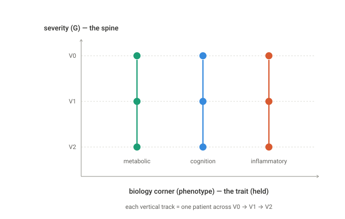
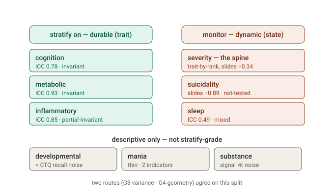
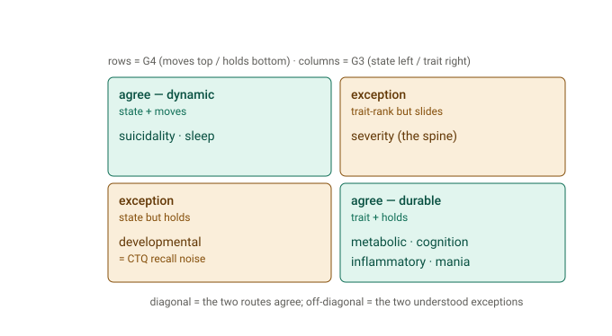
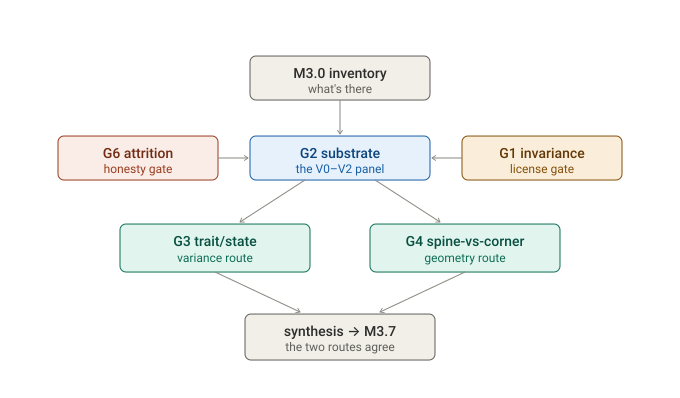

# M3 — Temporal coherence: findings

> **Paper-facing findings for Milestone 3 (read first).** What the longitudinal analysis (V0 → V1 → V2)
> establishes about whether the M1 transdiagnostic map and the M2 strata — both discovered on baseline —
> *cohere and persist over time*. Methods of record: [`TEMPORAL_MODEL.md`](TEMPORAL_MODEL.md); per-stage
> detail: [`TEMPORAL_RESULTS.md`](TEMPORAL_RESULTS.md) + `reports/30–37`. Sibling of
> [`M1_FINDINGS.md`](M1_FINDINGS.md) and [`STRATA_FINDINGS.md`](STRATA_FINDINGS.md).
> *Scope: internal coherence + persistence only. "Persists" ≠ "predicts" — prognosis is M4.*
> *Status: COMPLETE, pending PI sign-off. Updated 2026-06-10.*

---

## Headline

**The transdiagnostic map and its strata are temporally coherent.** Across follow-up the measurement means
the same thing it did at baseline (the precondition holds), and the M2 geometry replays over time: **the
cohort slides down severity and the symptom axes (state) while individual biological/cognitive positions —
and archetype identity — stay locked (trait).** Two patients keep their relative metabolic, inflammatory and
cognitive standing, and their corner archetype, even as both improve clinically. This is the M2 reading —
*severity is the spine the cloud slides along; the specific biology axes are durable corners* — confirmed in
time, by two independent routes that agree. It supports the project's clinical logic: **stratify on the
durable biology, monitor the moving symptoms.**

It is not a clean slam-dunk, and the refinements are the interesting part (§5–§6): severity is "state at the
population level but trait at the individual-rank level," and developmental-risk's apparent instability is a
measurement artefact, not change.

---

## 1. The question, and the answer

M3 asks whether the V0 discovery survives contact with follow-up — scored onto the **fixed** M1/M2 model,
observed cells only, uncertainty propagated, never re-discovered. Six goals, answered:

| goal | question | answer |
|------|----------|--------|
| **G1** invariance | does the map measure the same constructs at V1/V2? | **yes** (5/6 backbone axes invariant; inflammatory partial) |
| **G2** substrate | score the longitudinal panel | done — `patient_panel.parquet`, V0 reproduced at 99.9% |
| **G3** trait/state | which axes are durable vs fluctuating? | biology/cognition **trait**; severity + symptoms **state** (two lenses) |
| **G4** persistence | do strata/positions persist? spine-vs-corner? | **yes** — the "spine moves, biology holds" pattern (25.8%) outnumbers its converse (11.5%) by 2.2×; archetype identity persists above chance |
| **G6** attrition | is the retained sample fair? | dropout **mild** (cognition-leaning); verdicts robust |
| ~~G5~~ vs DSM-5 | — | **deferred to M4** (diagnosis is time-invariant in-data) |

---

## 2. The precondition holds — the map doesn't drift (G1)

Refitting the simple-structure backbone at each visit and comparing loadings by Tucker congruence φ vs V0:
**severity (φ=0.99), cognition (0.99), metabolic (0.99), sleep (1.00), developmental_risk (0.96) are
metric-invariant**; **inflammatory is partial (φ=0.90)** — its white-cell differential (WBC, monocytes,
eosinophils) shifts, an acute-phase signature, so inflammatory change carries a documented caveat. This is
the analogue of M1's cross-cohort invariance, and it is what *licenses* reading a follow-up coordinate change
as patient change rather than instrument drift. (The explicit non-Gaussian axes — suicidality, substance,
and thin mania — are not backbone-testable; their change is reported descriptively.)

---

## 3. Trait vs state needs two lenses (G3)

A measurement-error random-intercept model per axis, with the **known M1 measurement variance plugged** (so
a low-reliability axis cannot masquerade as state) and **visit fixed effects** that absorb the population
trajectory (so a shared improvement is not miscounted as individual instability). The result splits into two
complementary lenses:

- **Population slide** (the cohort trend, `pop_slide`): the cohort improves on the **symptom/severity axes**
  — suicidality −0.89, severity −0.34, mania/cognition/developmental ≈ −0.16 — and is **static on biology**
  (metabolic +0.10, inflammatory +0.05). *The cloud slides down severity/symptoms; the biology stays.*
- **Individual rank-stability** (ICC, after removing the slide): once the shared improvement is removed,
  individual positions are **mostly preserved** — metabolic ICC 0.93, inflammatory 0.85, cognition 0.78,
  severity 0.66 (trait); sleep 0.49, suicidality 0.46, developmental 0.39 (mixed/state); substance is
  uninformative (signal ≪ noise).

The cleanest, licensed, predicted-trait matches land exactly: **metabolic and cognition are strongly,
durably trait.** And the two lenses together are the point: *the cohort moves on severity, but individuals
keep their relative biological standing.*

---

## 4. The geometry replays over time (G4)

The per-patient, uncertainty-aware geometric route (a move counts only if it clears measurement error):

- **Spine-vs-corner:** severity moves in **34.5%** of patients; the biology corner
  (metabolic/inflammatory/cognition) moves in only **20.2%**. The §1.4 cell — *spine moves while biology
  holds* — is **25.8%** of patients versus the anti-pattern (biology moves, spine holds) at **11.5%**: a
  **2.2× edge**. Patients slide on the spine more than they shift their biology corner.
- **Archetype identity persists:** patients keep their G-residualized (Arm-B) corner archetype **52%** of the
  time — well above the 12.5% chance rate (κ = 0.27), with a weight-vector cosine median of 0.81. Corner
  identity holds, as a soft continuum should (central patients churn their argmax by geometry, corners stay).
- **Who moves** tracks G3: sleep 53%, severity 33%, suicidality 32% move; inflammatory 6%, mania 8%,
  cognition 10%, metabolic 17% hold. Severity trajectories: 60% stable, 33% drifting (the improvers), 7%
  oscillating.

---

## 5. The synthesis — two routes, one conclusion (G3 ⟷ G4)

§1.4's real test is whether the **variance route** (G3) and the **geometry route** (G4) agree. The simple
correlation (reliable-change-rate vs ICC) is ρ = −0.33 — the right sign, but weak — and the dilution is
itself informative, because **exactly two axes diverge, for understood reasons**:

1. **severity** — G3-trait (individual *ranks* preserved) yet G4-moves (the population *slides*). The two
   routes measure different things; both are correct. Severity is *rank-stable but level-mobile*.
2. **developmental_risk** — G3-state yet G4-holds. Here G4 is the **more robust** route: the reliable-change
   rule ignores the cross-visit CTQ recall wobble that inflates G3's within-person variance but never clears
   the measurement band.

Strip those two principled exceptions and **the core agrees both ways**: the biology/cognition axes are
durable (high ICC, low reliable-change), the symptom axes (sleep, suicidality) move (low ICC, high
reliable-change). The geometry of M2 — biology corners, severity spine — is temporally coherent.

---

## 6. Discussion — what we predicted, what we observed

The M3 hypotheses were **geometrically derived** from M1 (a bifactor map: G plus orthogonal specifics) and
M2 (a continuum: severity is the spine, the biology axes are the corners). Each was something the data could
have refuted — which is what makes the milestone a test rather than a restatement.

| hypothesis (from §1.4) | observation | verdict |
|---|---|---|
| **H0** the map measures the same constructs at follow-up | 5/6 backbone axes invariant (φ 0.96–1.00); inflammatory partial | confirmed |
| **H1** severity = state | trait at the individual rank (ICC 0.66); state as a population slide (−0.34) | refined (two lenses) |
| **H1** biology corners = trait | metabolic 0.93, cognition 0.78, inflammatory 0.85 | confirmed |
| **H1** developmental = trait | ICC 0.39 ("state") — traced to CTQ recall noise, not change | artifact, localized |
| **H2** spine moves, corner holds | spine 34.5% vs biology corner 20.2%; §1.4 cell 2.2× the anti-pattern | confirmed |
| **H3** archetype identity persists | 52% dominant agreement (κ 0.27, vs 12.5% chance) | confirmed (moderate) |
| **H4** the two routes agree | core agrees; ρ=−0.33, diluted by 2 principled exceptions | confirmed with nuance |
| **H5** attrition doesn't invalidate it | dropout mild, severity-neutral | confirmed |

Three things the methodology taught us:

- **The nuance is the guards working, not failing.** The frozen V0 scale is the only reason the population
  slide is visible at all (re-standardizing per visit would have erased it); the plugged measurement variance
  is why low-reliability axes don't masquerade as state; the visit fixed effects are what forced the severity
  *slide-vs-rank* distinction the hypothesis had quietly conflated. The result is nuanced *because* the design
  refuses to let a shared improvement be miscounted as individual instability.
- **A measurement model has blind spots, and the data found one.** Childhood trauma cannot be state, yet G3
  called developmental the most state-like axis. The plugged variance captures *within-visit* uncertainty,
  not *cross-visit* recall inconsistency — so re-administered CTQ wobble landed in σ²_w. The tell was that
  completers (three CTQ administrations) looked *more* state, and G4's reliable-change rule — robust to
  sub-band wobble — correctly says developmental holds. The two routes *disagreeing here* is what localized
  the artifact.
- **A weak synthesis correlation is the healthier result.** ρ=−0.33 is diluted by exactly the two axes we
  can explain. A near-perfect correlation between two operationalizations of the same quantity would signal
  redundancy, not corroboration — two *independent* routes agreeing on the core while diverging for *named*
  reasons is the stronger evidence.

**What would have falsified the story** (and didn't): invariance failing (the map is V0-specific); the
biology corners coming out noisy (low ICC); the archetypes dissolving (persistence at chance). The §1.4
geometry survived every test it could have failed.

---

## 7. Honesty and limits (G6 and caveats)

- **Attrition is mild and does not flip the story (G6).** Retention V0 9,013 → V1 47% → V2 33%. Who stays is
  only weakly predicted by V0 position — severity is ~neutral (the improved do *not* preferentially leave),
  the one real signal is cognitive impairment (the impaired drop out somewhat more). The trait/state
  verdicts are robust completers-vs-all (max |ΔICC| = 0.14), and inverse-probability weights are available.
- **developmental_risk's "state" is measurement, not change.** Childhood trauma is fixed; re-administering
  CTQ injects recall inconsistency that the within-visit measurement variance can't absorb. The construct is
  trait by design — flagged, not hidden (G4's reliable-change rule correctly says it holds).
- **inflammatory is partial-invariant**, **substance is uninformative** (2-cohort, prior-dominated), and
  **mania / suicidality / substance are not G1-tested** (explicit block) — all reported descriptively, never
  forced into a finding.
- **Three visits** make trajectory typing coarse and the window short (V0–V2); the interim sub-yearly visits
  and V3+ are out of scope. DSM-5 diagnosis is time-invariant in this dataset, so the "better than DSM"
  temporal head-to-head is deferred to M4 (the diagnosis-change exit signal is captured for it).

---

## 8. What this hands to M4

The per-(patient, visit) substrate is `results/face/patient_panel.parquet`; the axis-level verdict is
`reports/37_axis_summary.csv`. The operative split for prognosis:

- **Durable, stratify-on dimensions** (licensed, trait, stable): **cognition, metabolic, inflammatory** —
  the biology corners a patient *keeps*, the right axes to stratify and predict on.
- **Monitoring dimensions** (move over time): **severity** (the spine — rank-stable but the cohort slides),
  **suicidality, sleep** — track these as dynamic state / candidate outcomes, don't stratify on them.

M3 establishes that the signal **coheres and persists**. Whether a baseline coordinate or stratum **predicts
a future outcome, incrementally beyond diagnosis and severity**, is M4. **Persists ≠ predicts.**

---

## Figures

**The headline, in one picture** — severity (the spine) slides over V0→V2 while each patient keeps their
biology corner:

**Why severity needs two lenses** — every line falls (the cohort slides, state), but they stay parallel and
ordered (individual rank is held, trait):

**The actionable read-out for M4** — durable axes to stratify on vs dynamic axes to monitor, with the
caveated axes set apart:

**The synthesis, honestly** — the two routes cross-tabulated: the agreement diagonal plus the two
understood exceptions:

**The methodology as a map** — the G1–G6 pipeline and how the gates condition the headlines:

**Data figures** (generated by the pipeline): `33_congruence.png` (G1 invariance) · `35_trait_state.png`
(the variance decomposition) · `36_spine_corner.png` + `36_transitions.png` (G4 persistence) ·
`31_attrition.png` (informative dropout) · `30_retention.png`, `30_axis_coverage.png`, `32_coverage.png`,
`34_trajectories.png` (coverage, density, trajectories).
