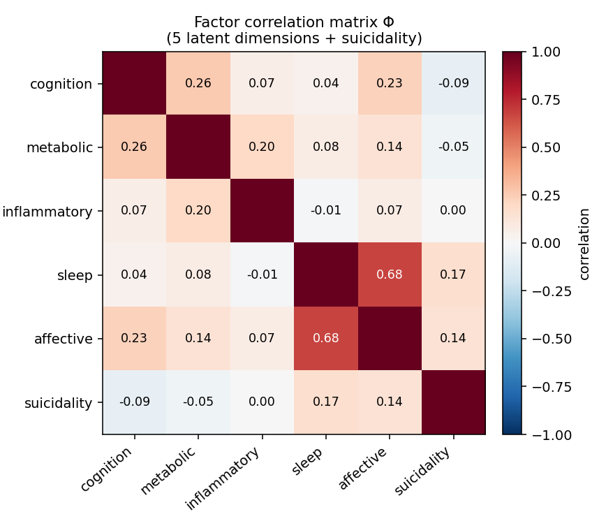
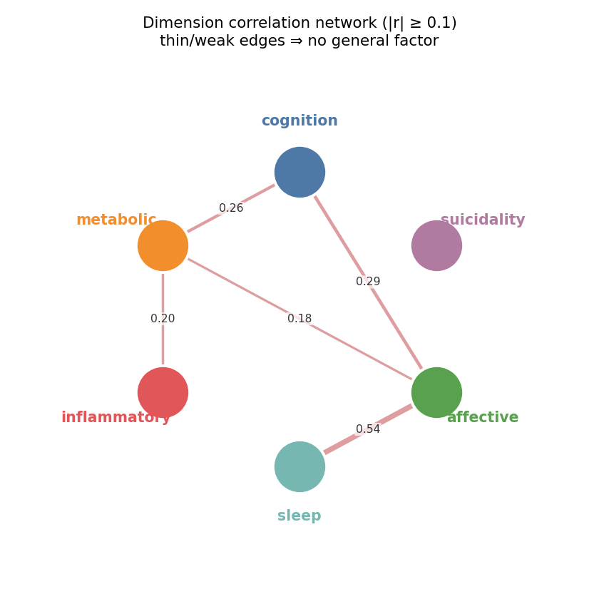
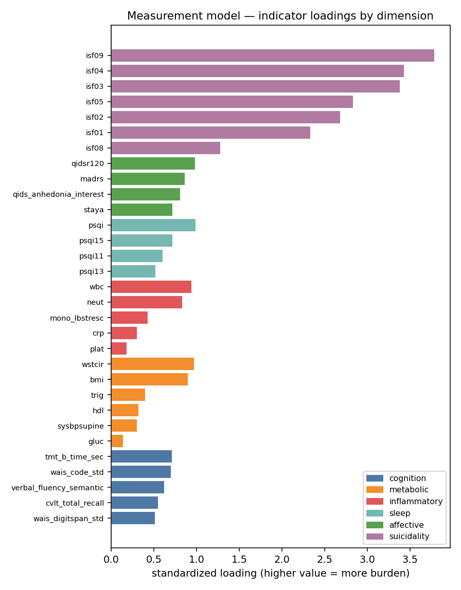
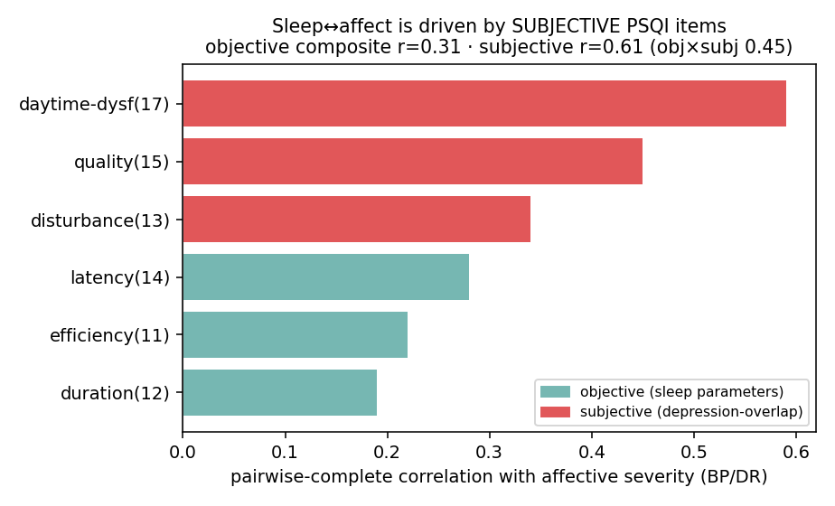
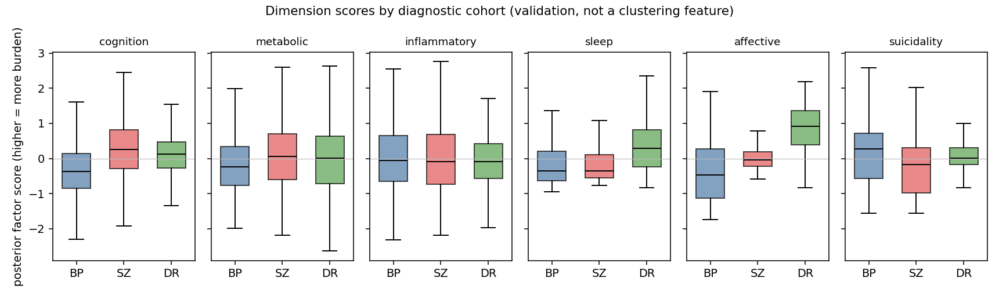

# V3 results — the certified transdiagnostic measurement model

> Living results page for the V3 **measurement layer** (Phases F–G). Plan: [`V3_PLAN.md`](V3_PLAN.md) ·
> step journal: [`LABBOOK_V3.md`](LABBOOK_V3.md) · numbers log: [`FINDINGS.md`](FINDINGS.md). Figures are
> aggregate (no per-patient data); regenerate with `scripts/v3/04_extended_model.py` → `05_visualize.py`.

## The model

A patient-level, **no-imputation** latent model on the V0 baseline, **cohort-balanced** (500
most-complete patients per cohort — BP/SZ/DR equal, so the BP-dominant sample size cannot drive the
structure):

- **5 Gaussian factors** estimated by a **marginalized** observed-data likelihood (factors integrated
  out → certifiable geometry): **cognition · metabolic · inflammatory · sleep · affective**. Affective
  (MADRS/QIDS/STAI/anhedonia) is BP/DR-measured; SZ contributes no affective cells (handled by the
  observed-data likelihood, never imputed). **Sleep** uses the *objective* PSQI parameters (efficiency,
  duration, latency) — see §3 for why the subjective items were dropped.
- **Suicidality** as an **explicit-latent module with mixed likelihoods** — 7 ISF items (Bernoulli) +
  attempt count (negative-binomial), 3-cohort.

**Certified:** max R-hat **1.010**, min ESS **991**, **0 divergences** (N=1,500, 4 chains; 15
observed-patterns, ~23% rare-pattern tail dropped — see Caveats).

## 1 · Correlation structure — no general factor

**Mean |off-diagonal| ≈ 0.17 (0.13 excluding sleep↔affective) — there is no general psychopathology
factor.** The dimensions are a *weakly-correlated coordinate system*, not one axis of "severity." A
single-factor (general-burden) model does not even identify on these data. For a precision-psychiatry
framework this is load-bearing: a patient cannot be summarized by one number — the multidimensional
profile is the object, which is exactly what the stratification layer (Phase J) will act on.

What the off-diagonals say, and how we read them:

- **Symptoms (affective) ≈ orthogonal to biology.** affective×inflammatory **0.07**, affective×metabolic
  **0.18**. With the *symptom* factor inside the same latent model, mood/anxiety is nearly uncorrelated
  with inflammatory load and only weakly tied to metabolic load — a *within-model* factor correlation,
  not a between-block average, so it is a strong form of the claim. Implication: **biological strata and
  symptom strata are largely independent axes** — stratify on both, don't assume sick-mood ⇒ sick-body.
- **Sleep ↔ affective = 0.54 — the one moderately-strong edge** (§3 shows it was inflated to 0.68 by
  depression-overlapping PSQI items; 0.54 is the genuine construct-level coupling). Sleep is a separable
  dimension, but genuinely correlated with affect in the mood cohorts (insomnia ↔ depression).
- **Metabolic ↔ inflammatory = 0.20** — separable but related: two correlated-but-distinct biological
  loads (relevant to immunometabolic subtyping — a high-inflammation/normal-metabolic patient is a
  different target than the reverse).
- **Cognition** tracks **affective (0.29)** and **metabolic (0.26)** weakly, ≈ orthogonal to
  inflammation (0.07) and sleep (0.02) — cognitive burden bridges distress and metabolic load a little,
  inflammation not at all.

## 2 · Measurement model — what loads where

Loadings are clean and clinically coherent (oriented so higher = more burden): adiposity (BMI/waist)
and WBC/neutrophils anchor metabolic/inflammatory; the objective PSQI parameters anchor sleep;
MADRS/QIDS/STAI anchor affective; verbal memory / processing-speed / TMT-B anchor cognition; the ISF
items anchor suicidality. No Heywood blow-ups under the marginalized estimator.

## 3 · Sleep ↔ affective — why "objective" sleep, and what the 0.54 means

The first specification used the full PSQI sleep factor and gave sleep×affective = **0.68**. Decomposing
that coupling at the PSQI sub-item level (pairwise-complete correlations with affective severity, BP/DR) shows it is
driven by the **subjective** items, which overlap with depression symptoms:

- **Objective sleep parameters** — efficiency (0.22), duration (0.19), latency (0.28) → composite **0.31**.
- **Subjective items** — disturbance (0.34), quality (0.45), **daytime-dysfunction (0.59)** → composite
  **0.61**. Daytime-dysfunction is essentially a depression item (fatigue/anhedonia).

Refitting the latent model with **only the objective sleep parameters** drops the factor-level
sleep×affective from **0.68 → 0.54** while the model stays certified (R-hat 1.010, 0 div). **Read-out:**
~0.14 of the original coupling was PSQI method overlap; the residual **0.54 is a genuine construct-level
sleep–affect relationship** — sleep is a *separable* dimension but honestly moderately correlated with
affect in mood disorders. We therefore adopt the objective sleep factor as canonical and avoid the
depression-contaminated PSQI items. Reproducible: `scripts/v3/06_sleep_affect_sensitivity.py`.

## 4 · Suicidality (mixed-likelihood) — a distress-linked standalone

Suicidality (Bernoulli + negative-binomial indicators) correlates with **affective 0.10** and **sleep
0.09**, and is ≈ orthogonal to cognition (−0.08), metabolic (−0.05), inflammatory (0.00). It is **not** a
biology- or cognition-linked dimension; it sits closest to affective distress, but only weakly — a
standalone risk dimension with a modest, sensible distress link. The mixed-likelihood module
(binary + count) fit cleanly and certified.

## 5 · Dimension scores by cohort — clinical validation (diagnosis as a *check*, not a feature)

Diagnosis was **never** used to fit the dimensions; here we use it only to validate them. The scores
behave exactly as clinical knowledge predicts:

- **Cognition** — worst in **SZ** (highest burden), best in BP. Cognitive impairment is a schizophrenia
  hallmark → the cognition factor is measuring the right thing.
- **Sleep & affective** — worst in **DR** (depression), as expected.
- **Metabolic / inflammatory** — broadly **flat across cohorts** → biological load genuinely cuts across
  diagnoses (truly transdiagnostic), not a cohort marker.
- **Suicidality** — somewhat higher in **BP**.

⚠️ **Read the SZ affective box with care:** SZ has no affective indicators, so its affective score is a
*proxy* derived through the sleep↔affective relationship, not a measurement — it should not be compared
to BP/DR affective at face value.

## 6 · Informative missingness (MNAR)

The in-model MNAR arm is **not identifiable on the most-complete subsample** (cognition/suicide items are
~fully observed there by construction). The full-sample missingness analysis (V3-2) is the place for it:
the robust informative-missingness sits in **suicidality + self-report** completion (sicker patients skip
them). A de-biasing joint selection model on the full sample is future work.

## Caveats

- **~23% rare-pattern tail dropped** (`--min-group 10`) to keep the marginalized likelihood tractable —
  a mild extra completeness selection on top of the most-complete subsample. Lowering it (more Cholesky
  ops) is the next robustness step.
- **Affective + suicidality are BP/DR-anchored / cohort-heterogeneous**; SZ affective is a proxy.
- **Single visit (V0).** Temporal coherence (do these scores persist V1–V4?) is Phase H, not yet run.
- The suicidality↔factor correlations are read **post-hoc** from scores (mild attenuation toward 0).

## Bottom line

A certified, cohort-balanced, no-imputation transdiagnostic measurement model of BP/SZ/DR:
**no general factor; symptoms (affective) ≈ orthogonal to biology; metabolic and inflammatory are
separable; cognition tracks metabolic/affective weakly; suicidality is a distress-linked standalone; and
sleep is a separable dimension moderately correlated with affect (0.54) once depression-overlapping PSQI
items are removed.** Next: temporal coherence + measurement invariance (Phase H), then probabilistic
strata (Phase J).
